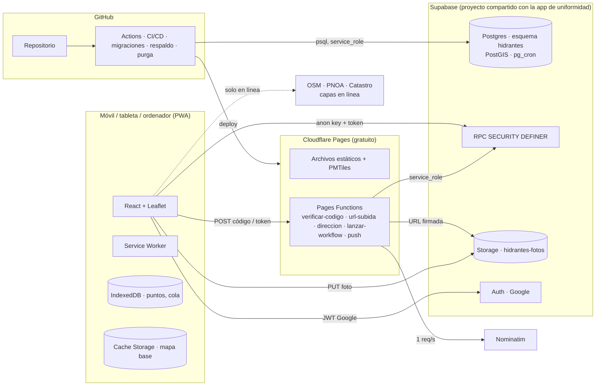
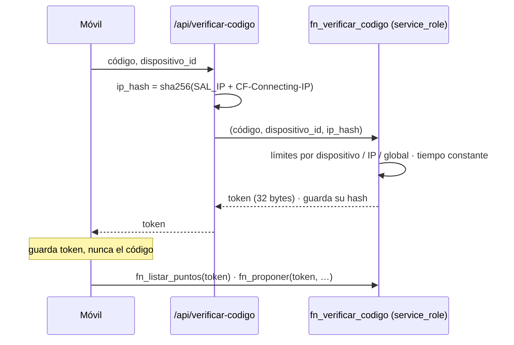
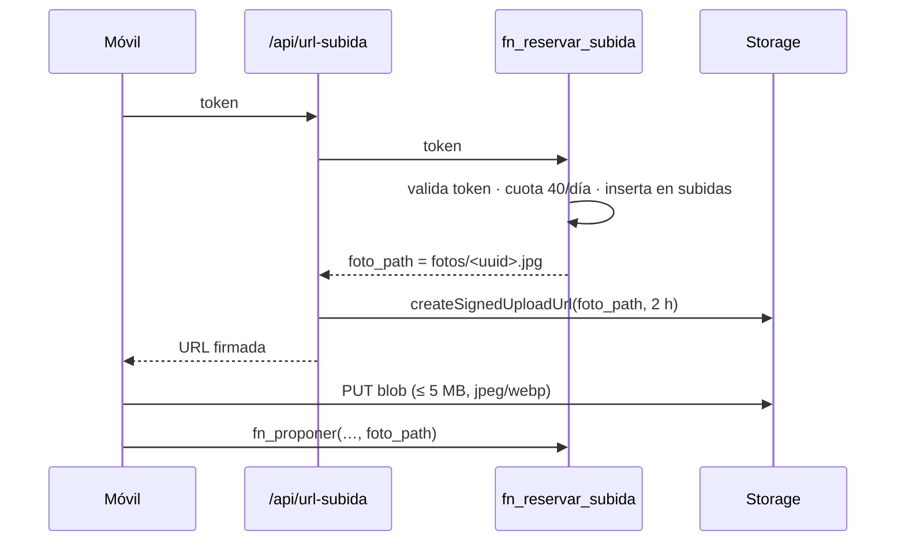

# 04 · Arquitectura e infraestructura — Mapa de hidrantes

| | |
|---|---|
| **Estado** | Congelado. Cambia con conformidad de jefatura y nueva versión; cada cambio arrastra una entrada en 12. |
| **Versión** | 1.2 — 17 de septiembre de 2026. Consolida el plan v2.1; v1.1 añadió skills, cabeceras, vigilancia y push; v1.2 añade §11.1 (control de versiones con Git y GitHub) y la ubicación local del repositorio; v1.3 (18 sep 2026) añade el rol `hidrantes_migrador` (DEC-052), repositorio público (DEC-053), `mantener-activo.yml` (DEC-054) y los ajustes del arranque (DEC-055). |
| **Propietario de** | las **decisiones de infraestructura y despliegue**: qué piezas hay, dónde corren, cómo se despliegan y cómo se vuelve atrás. |
| **No contiene** | el esquema ni las firmas (→ 05), las exigencias que motivan estas decisiones (→ 03), procedimientos de emergencia paso a paso (→ 15). |

Coste de software: **0 €**. Todo corre en planes gratuitos; ninguna pieza requiere tarjeta de crédito.

---

## 1. Vista general



Tres ideas resumen el diseño:

1. **El navegador nunca escribe directamente.** Toda mutación pasa por funciones RPC de Postgres que
   validan permisos y entrada y escriben la auditoría. La `anon key` es pública; la seguridad la dan
   RLS y las propias RPC.
2. **Lo que necesita ver la IP real o guardar un secreto va a una *Pages Function*.** Son cuatro,
   pequeñas, desplegadas junto al frontend, y son la única capa con la `service_role key`.
3. **Sin cobertura solo existe lo que ya está en el móvil.** Por eso los puntos viven en IndexedDB,
   el mapa base propio se descarga entero a Cache Storage, y las propuestas con su foto esperan en
   una cola local.

---

## 2. Stack

| Capa | Elección | Por qué |
|---|---|---|
| Frontend | React + TypeScript + Vite + Tailwind + shadcn/ui | Misma base que la app de uniformidad; una sola persona lo mantiene. |
| Mapa | Leaflet + `protomaps-leaflet` para el **mapa base propio en PMTiles**; capas ráster en línea OSM, PNOA (WMTS), Catastro (WMS) | La política de OSM prohíbe precargar teselas (TR-70); un archivo PMTiles propio es legal, gratis y funciona sin conexión por diseño. |
| Geometría en cliente | Turf.js (`booleanPointInPolygon`, `distance`) | Aviso de fuera de zona y distancias sin ir al servidor. |
| Backend / BD | Supabase: Postgres con **esquema `hidrantes`**, PostGIS, `pg_cron` | Proyectos ya existentes; el plan gratuito no permite crear más. |
| Almacenamiento | Supabase Storage, bucket `hidrantes-fotos` | Subida **solo con URL firmada** (§7). |
| Auth jefatura | Supabase Auth con Google, ya configurado por la app de uniformidad | Permisos en `hidrantes.administradores`, no en `public.app_users`. |
| Acceso voluntario | Código de 6 dígitos canjeado una vez por un **token de dispositivo** | El código no vuelve a viajar; el límite de intentos no molesta a quien ya entró. |
| Offline | Service Worker (`vite-plugin-pwa`), IndexedDB (`idb`), Cache Storage | TR-01–TR-08. |
| Hosting | Cloudflare Pages + cinco **Pages Functions** (TypeScript) | Gratuito, CDN, despliegues inmutables, funciones en el mismo dominio. |
| Dirección | Nominatim (OSM), desde una Pages Function, ≤ 1 req/s | FR-15, TR-72. |
| Tareas programadas | `pg_cron` para purgas SQL; GitHub Actions para lo que necesita `service_role` fuera de la BD (respaldo, fotos huérfanas, promoción del piloto) | Nada depende de que alguien lo lance a mano. |
| CI/CD | GitHub Actions | build, typecheck, lint, tests SQL, e2e, migraciones automáticas. |
| E2E | Playwright | También genera las capturas del manual del voluntario. |
| Errores | Tabla `errores_cliente` | Sin servicio externo. |

---

## 3. Principios de arquitectura

1. **`puntos` guarda el estado actual; `registro` guarda la historia.** Un hidrante tiene un único
   estado verdadero en cada momento, así que `puntos` es mutable; la trazabilidad la garantiza que
   toda mutación pasa por una RPC que escribe en `registro` el antes y el después. Un libro mayor
   *append-only* como fuente única obligaría a recalcular el estado en cada lectura del mapa sin
   ventaja alguna.
2. **Nada entra al mapa sin aprobación.** Los voluntarios escriben en `propuestas`, nunca en
   `puntos`. Solo las RPC de administrador trasladan una propuesta a `puntos`.
3. **Integridad de escritura en la base de datos.** Toda mutación va por RPC `SECURITY DEFINER` que
   validan permisos, validan la entrada y escriben auditoría. El navegador nunca hace `insert` ni
   `update` directo.
4. **RLS como única puerta.** La `anon key` es pública; `anon` no tiene acceso directo a ninguna
   tabla ni vista, solo `execute` sobre las RPC de voluntario.
5. **Identidad del dispositivo, no del nombre.** Nombre y apellido son *atribución*; el control de
   propiedad (mis propuestas, retirar la mía) se hace contra un `dispositivo_id` uuid generado en
   el móvil.
6. **Códigos estables.** `HID-####` y `BOC-####` por secuencias de Postgres; nunca reutilizados.
7. **Migraciones versionadas** en `supabase/migrations`, aplicadas por CI. Cero cambios a mano en el
   panel de Supabase, en ningún entorno.
8. **Cero pasos manuales reproducibles.** Lo que se pueda hacer con un script, se hace con un script
   que queda en el repositorio.
9. **Nada llega a Storage sin una URL firmada.** La `anon key` no puede escribir en el bucket.
10. **Jefatura también trabaja desde el móvil.** Misma PWA, sesión de Google, cambios aplicados al
    momento y registrados como acción de administrador.
11. **Las exigencias viven en 03; aquí vive la solución.** Si una pieza cambia (otro proveedor de
    mapa, otro hosting), se actualiza este documento y 12; 03 no se toca.

---

## 4. Entornos

Dos entornos completos y aislados. **Ningún dato, credencial ni bucket se comparte entre ellos.**

| | **staging** | **producción** |
|---|---|---|
| Rama de Git | `develop` | `main` |
| Proyecto Cloudflare Pages | `hidrantes-albolote-staging` | `hidrantes-albolote` |
| URL | `hidrantes-albolote-staging.pages.dev` | `hidrantes-albolote.pages.dev` |
| Proyecto Supabase | **dev** (el existente de la app de uniformidad) | **prod** (el existente) |
| Esquema | `hidrantes` | `hidrantes` (idéntico, mismas migraciones) |
| Bucket de Storage | `hidrantes-fotos-dev` | `hidrantes-fotos` |
| Código de acceso | `000000` en el seed inicial; para el piloto, uno real generado desde Ajustes | real, generado y rotable |
| `administradores` | correos de prueba + el del propietario | el propietario al arrancar; el resto desde Ajustes |
| Datos | seed de 12 puntos `[PRUEBA]` (idempotente, nunca pisa datos existentes) + los del piloto | vacío al arrancar; recibe los datos del piloto con `promover-piloto.ts` |
| Indexación | `robots.txt` `Disallow: /` y meta `noindex` | normal |
| Aviso visual | banda naranja permanente "ENTORNO DE PRUEBAS" (`VITE_ENTORNO=staging`) | ninguna |
| Despliegue | automático al hacer merge a `develop` | automático al hacer merge a `main`, con **aprobación manual** del *environment* de GitHub |
| Migraciones | las aplica CI | las aplica CI tras la aprobación |

Nombres fijos (DEC-045): repo `hidrantes-albolote`; R2 `hidrantes-mapabase` y `hidrantes-mapabase-staging`
solo si el PMTiles supera 20 MB. La cuenta de Cloudflare ya está bajo la cuenta de Google del
desarrollador (misma que Supabase y GitHub); `wrangler login` con ella basta para el arranque.

Reglas:

- Las migraciones son las mismas y en el mismo orden. Producción nunca recibe una migración que no
  haya pasado por staging; lo garantiza el flujo de ramas.
- **Producción tiene siempre la versión completa de staging** (DEC-096). Producción solo por PR
  `develop → main` con aprobación del desarrollador en el *environment* `production`. Al cerrar cada
  bloque de trabajo se abre ese PR, con *merge commit* para que las dos ramas compartan historia, y
  el paso "Paridad con develop" de `deploy-prod.yml` comprueba que producción quedó igual. Poner
  producción al día no abre el acceso: el código real se comunica en F9.10 (#85).
- El seed es un archivo aparte (`supabase/seed-staging.sql`) y la CI de producción **aborta** si su
  nombre aparece en el comando o si `PROJECT_REF` no es el esperado.
- Cada punto ficticio del seed lleva `descripcion` con prefijo `[PRUEBA]`.
- Las *preview deployments* de Cloudflare (una URL por Pull Request) apuntan siempre a Supabase
  **dev**.
- **Antes de cada PR `develop → main`**, `npm run comprobar-produccion -- --completo` (docs/19 P-01,
  docs/20 RV-73) comprueba, sin cambiar nada ni imprimir valores, que producción tiene los secretos,
  variables y migraciones que la versión nueva necesita. En local mira GitHub, Pages y la Data API; lanza
  `comprobar-produccion.yml`, que mira la base de datos de producción y el token de Cloudflare (solo
  están en los secretos), y une las dos mitades en una tabla. Lo que no puede mirar sale como "NO
  COMPROBADO", nunca como OK. Sale con 1 si falta algo imprescindible y con 2 si algo imprescindible
  queda sin comprobar; `--parcial` acepta una sola mitad y lo dice.
- Los tests (SQL, e2e) corren contra una **instancia local efímera** (`supabase start` en el runner)
  con las Pages Functions servidas por `wrangler pages dev`. Nunca contra dev ni prod: dos ramas a la
  vez se pisarían los datos, y un test que borra algo en una base compartida con la app de uniformidad
  es un accidente esperando a ocurrir.

---

## 5. Convivencia con la app de uniformidad

Los dos proyectos de Supabase ya existen y los usa la otra aplicación. Tres problemas, resueltos
antes de la primera migración:

| Problema | Solución |
|---|---|
| **Historial de migraciones compartido.** El CLI guarda lo aplicado en `supabase_migrations.schema_migrations`, una tabla por base de datos; dos repositorios con `supabase db push` se verían las migraciones del otro como desconocidas. | Este proyecto **no usa `supabase db push`**. `scripts/migrar.ts` aplica los archivos de `supabase/migrations/` con `psql`, en orden y en una transacción, contra un historial propio `hidrantes.migraciones_aplicadas` (archivo, hash, fecha). Aborta si el hash de una migración ya aplicada ha cambiado. |
| **`public.app_users` es de la otra app.** Reutilizarla tal cual convertiría a todo administrador de uniformidad en administrador de hidrantes, y añadirle una columna crearía *drift* en un esquema que gestiona otro repositorio. | Tabla propia **`hidrantes.administradores`**. `fn_es_admin()` comprueba el email del JWT contra ella. `public` no se toca; el panel solo lee `app_users` para sugerir correos. |
| **PostGIS se habilita para toda la instancia.** | Primero en dev; se comprueba que la app de uniformidad sigue bien; después en prod. |
| **Desde el 30 oct 2026 Supabase no concede acceso a la Data API a tablas nuevas de `public`.** | No nos afecta: `hidrantes` tiene permisos explícitos (`0003_permisos.sql` revoca todo y concede a medida), y la app solo **lee** `public.app_users`, que ya existe y conserva sus grants. Toda tabla nueva de `hidrantes` lleva en su migración los `grant` que necesite (05 §5), y `02_permisos.test.sql` falla si a una tabla le faltan los de `service_role` (docs/19 RV-70). **A quien sí afecta es a la app de uniformidad**, que usa `public` en el mismo proyecto: sus tablas nuevas necesitarán sus `grant` en su propia migración. |
| **La contraseña de `postgres` alcanza también `public`.** | Solo la usa `arranque.ts`, en memoria, para crear extensiones, el esquema y el rol `hidrantes_migrador` (propietario de `hidrantes`, sin privilegios en `public`). Todo lo automático usa ese rol (DEC-052). |

### Consumo del plan gratuito (compartido)

| Recurso | Límite | Estimación de este módulo |
|---|---|---|
| Base de datos | 500 MB | 1.000 puntos con su auditoría: < 20 MB |
| Storage | 1 GB | **Recurso crítico.** ~250 kB por foto → 1.000 puntos ≈ 250 MB, más fotos de propuestas pendientes |
| Transferencia | 5 GB/mes | Teselas desde OSM/IGN, no desde Supabase; solo cuentan fotos y datos |

Palancas si el almacenamiento se acerca al límite: bajar la calidad de compresión; después, mover
las fotos a Cloudflare R2. El campo se llama `foto_path` y no `foto_url` para poder cambiar de
proveedor sin migrar datos.

---

## 6. Acceso: código, token y Pages Functions



Por qué así y no de otra forma:

- El límite **por dispositivo** solo no basta: el `dispositivo_id` lo genera el móvil y un atacante
  cambia de uuid en cada intento.
- El límite **por IP** no puede leerse de `x-forwarded-for` dentro de Postgres: el cliente la puede
  falsificar. La *Pages Function* ve `CF-Connecting-IP`, que Cloudflare impone y el cliente no puede
  alterar. Es la única capa que conoce la IP real, y la sal (`SAL_IP`) vive solo ahí.
- El **techo global** (200/h) es la última red: recorrer el millón de combinaciones llevaría años.
- El **token de dispositivo** hace que los 65 voluntarios no vuelvan a pasar por el sistema de
  intentos, así que activar el techo global no deja a nadie fuera.
- **Nadie salta la Function:** `fn_verificar_codigo` no tiene `execute` para `anon` ni
  `authenticated`; solo la ejecuta la Function con `service_role`.

Las cinco Pages Functions (`functions/api/`), en TypeScript, con su contrato en 05 §9:

| Ruta | Función |
|---|---|
| `POST /api/verificar-codigo` | Canje del código por token, con la IP real. |
| `POST /api/url-subida` | Reserva de subida y URL firmada para una foto. |
| `GET /api/direccion` | Reverse geocoding en Nominatim, solo con JWT de administrador, ≤ 1 req/s, resultado cacheado en la propuesta. |
| `POST /api/lanzar-workflow` | `workflow_dispatch` a un workflow de una lista blanca (`purgar-fotos`, `regenerar-zona`, `regenerar-mapabase`, `respaldo`), solo con JWT de administrador. Con `workflow_dispatch` el token basta con `actions:write` (DEC-069). |
| `POST /api/geocodificar` | Números de portal para la búsqueda con CartoCiudad (IGN/CNIG), con token de voluntario o JWT de administrador, nunca anónima; 5 s como mucho, caché de 30 días por el sha256 de la consulta, que no se registra (DEC-092, 05 §9). |
| `POST /api/push` | Envía las notificaciones pendientes (`notificaciones`) por Web Push con las claves VAPID; la llama el cliente tras cada acción que genera avisos y el trabajo diario de vigilancia. Idempotente. |

---

## 7. Fotos: Storage con URL firmada



- **Ninguna política de escritura para `anon`.** Límites del bucket (fijados por `arranque.ts`): 5 MB,
  `image/jpeg` e `image/webp`; sin `list`, `update` ni `delete` para nadie salvo `service_role`.
- **Lectura pública** por URL no enumerable (uuid). Las URL firmadas de lectura romperían la caché
  offline de fichas; se descarta a sabiendas. La foto retrata un hidrante, no una persona (11).
- **Las fotos no se mueven al aprobar.** Storage guarda los bytes fuera de Postgres; una función SQL
  no puede copiar archivos. `puntos.foto_path` pasa a apuntar al archivo ya subido.
- **Purga de huérfanas:** workflow semanal con `service_role`, que pide a `fn_fotos_referenciadas_lista()`
  la lista de paths protegidos (puntos, propuestas pendientes o aprobadas, reservas de menos de `dias_reserva_subida`, 7 días, DEC-084), lista
  el bucket y borra el resto. La lista llega en una sola fila con su total, porque PostgREST corta en
  1.000 filas cualquier RPC que devuelva un conjunto. El guion no borra nada si la lista no cuadra con
  el total, si trae un múltiplo exacto de 1.000 o si la pasada borraría más de max(50, 10 %) del
  bucket (eso solo a mano, con `--forzar`, tras un `--ensayo`). Justo antes de borrar vuelve a pedir la
  lista (docs/18 RV-33). Desde Ajustes se lanza el mismo workflow vía `/api/lanzar-workflow`. Una
  foto referenciada por un punto nunca se borra, aunque su propuesta original se rechazara después.
- **El tratamiento de la imagen es en el móvil:** orientación EXIF aplicada, ≤ 1600 px, recompresión
  (elimina metadatos), y coordenadas EXIF leídas antes y enviadas aparte como `exif_geom`.

---

## 8. Mapa base propio (PMTiles)

- `scripts/generar-mapabase.ts` (`npm run mapabase`) extrae con `pmtiles extract` el recuadro de
  Albolote y Calicasas de las compilaciones públicas de Protomaps (datos OSM, ODbL), sin descargar
  el planeta. Imprime el tamaño.
- **Dónde se sirve:** ≤ 20 MB, dentro del despliegue de Pages; si pesa más, `arranque.ts` crea un
  bucket **R2** con CORS para los dos dominios y el script lo sube ahí. El frontend lee la URL de
  `VITE_MAPABASE_URL`, así que el cambio no toca código. Se esperan 8–15 MB.
- **Offline de verdad:** en línea se lee por rangos bajo demanda; sin cobertura solo existe lo
  descargado, y el Service Worker no cachea bien respuestas parciales. La aplicación descarga el
  archivo completo (automáticamente con wifi, o desde Ajustes), lo guarda en Cache Storage y sirve
  los rangos desde ahí con un `fetch` interceptado. `datos/meta.json` lleva la versión; cuando cambia,
  el móvil ofrece descargar la nueva.
- Estilo claro y oscuro definidos en el mismo archivo (`src/lib/estilo-mapabase.ts`), con los tokens
  de 06.
- Se regenera un par de veces al año, como la zona de cobertura.

### Capas en línea

Todas las URL en `src/lib/capas.ts`. OSM estándar (con `User-Agent`/`Referer` identificables, sin
precarga), PNOA del IGN por WMTS, Catastro por WMS. Las capas ráster se cargan con ``, que no
está sujeto a CORS; como son solo en línea, el Service Worker no las cachea. Sin conexión aparecen
en gris con el motivo.

### Zona de cobertura

`scripts/generar-zona.ts` consulta Overpass (relaciones `admin_level=8` de Albolote y Calicasas),
simplifica, une, aplica un margen de 400 m y escribe `datos/zona-cobertura.geojson`,
`datos/limite-municipal.geojson`, `datos/nucleos.geojson`, `datos/meta.json` y una previsualización
`datos/zona-cobertura.html`. Los GeoJSON se committean; el build nunca depende de Overpass.
`scripts/cargar-zona.ts` los carga en `hidrantes.limite_municipal` y `hidrantes.nucleos` con `upsert`
idempotente desde CI, tras las migraciones. No van por migración: regenerar el límite no debe generar
una migración nueva cada vez. Si la geometría recién consultada es la misma que la committeada,
`generar-zona.ts` no escribe nada: la `version` es la fecha del día y, sin esa comprobación, cada
Mantenimiento abriría un PR cuyo único cambio sería esa fecha (DEC-070).

---

## 9. Tareas programadas y trabajos

| Trabajo | Dónde | Cuándo |
|---|---|---|
| Purga de `intentos_codigo` > 24 h | `pg_cron` | cada hora |
| Purga de papelera pasado `dias_papelera` | `pg_cron` | diario |
| Purga de reservas de subida de más de 30 días (`hidrantes_purgar_subidas`, DEC-084) | `pg_cron` | diario |
| Borrado de `errores_cliente` > 90 días | `pg_cron` | diario |
| Revocación de tokens sin uso en `dias_caducidad_token` | `pg_cron` | diario |
| Resumen semanal de jefatura encolado (FR-164) | `pg_cron`; lo envía `/api/push` (DEC-068) | lunes |
| Purga de fotos huérfanas | GitHub Actions `purgar-fotos.yml` (`service_role`) | semanal + bajo demanda desde Ajustes |
| Respaldo cifrado de la BD (`pg_dump` del esquema `hidrantes`) | GitHub Actions `respaldo.yml` (`service_role`, GPG) | semanal, 90 días de retención |
| Respaldo del bucket de fotos | mismo workflow | mensual |
| Promoción de los datos del piloto | GitHub Actions `promover-piloto.yml` (manual, con aprobación) | una vez |
| Versión del mapa base en `config.version_mapabase` (`cargar-version-mapabase.ts`, tras desplegar y comprobar lo servido; RV-21) | GitHub Actions `deploy-*.yml` | cada despliegue |
| Mantener activos los proyectos de Supabase (DEC-054) | GitHub Actions `mantener-activo.yml` | diario |
| Vigilancia (app responde, RPC responde, respaldo reciente, envío de push pendientes) | GitHub Actions `vigilancia.yml`; abre una issue si falla | diario |
| Regenerar zona / mapa base | GitHub Actions `mantenimiento.yml` (por `workflow_dispatch` desde Ajustes, DEC-069); abre un PR a `develop` con lo regenerado | bajo demanda |
| Actualización de dependencias | Dependabot + `automerge.yml` (parches y menores con CI verde) | semanal |
| Lighthouse y cabeceras | dentro de `deploy-staging.yml`, tras desplegar | cada despliegue |

Regla: lo que es puro SQL va por `pg_cron`; lo que necesita `service_role` fuera de la base de datos
(archivos, cifrado) va por GitHub Actions. Los respaldos **no se commitean** a ninguna rama:
contienen nombres de voluntarios y el historial de Git es imposible de purgar.

---

## 10. Secretos

Viven en **tres sitios y solo en tres**: GitHub Environments (`staging`, `production`) y las
variables de cada proyecto de Cloudflare Pages. Ningún `.env` committeado; `.env.example` con los
nombres y sin valores. Los carga `scripts/arranque.ts`.

| Dónde | Secreto | Para qué |
|---|---|---|
| GitHub (ambos entornos) | `CLOUDFLARE_API_TOKEN`, `CLOUDFLARE_ACCOUNT_ID` | desplegar a Pages y, desde staging, el Worker `hidrantes-avisos`. El token necesita **Pages: Edit** y **Workers Scripts: Edit** (docs/19 P-01) |
| GitHub (por entorno) | `SUPABASE_DB_URL` | `psql` para `migrar.ts`, `cargar-zona.ts`, `pg_dump`. **Cadena del pooler de Supavisor en modo sesión (puerto 5432)**: los runners de GitHub no tienen IPv6. Usuario **`hidrantes_migrador`**, nunca `postgres` (DEC-052) |
| GitHub (por entorno) | `SUPABASE_URL`, `SUPABASE_SERVICE_ROLE_KEY` | purga de fotos, respaldo del bucket, `promover-piloto.ts` |
| GitHub (production) | `GPG_PUBLIC_KEY` | cifrar el respaldo. La privada **no** está en GitHub: se imprime una vez al arrancar y va al sobre o al gestor de contraseñas de la agrupación |
| Cloudflare Pages (por proyecto, cifradas) | `SUPABASE_URL`, `SUPABASE_SERVICE_ROLE_KEY`, `SAL_IP`, `GITHUB_DISPATCH_TOKEN` (permiso único `actions:write`), `NOMINATIM_USER_AGENT`, `VAPID_PRIVATE_KEY`, `VAPID_PUBLIC_KEY` (DEC-059), `VAPID_SUBJECT`, `VIGILANCIA_SECRETO` (DEC-088) | las Pages Functions |
| GitHub (variables por entorno, públicas) | `VITE_ENTORNO`, `VITE_SUPABASE_URL`, `VITE_SUPABASE_ANON_KEY`, `VITE_MAPABASE_URL`, `VITE_VAPID_PUBLIC_KEY`, `PAGES_PROYECTO`, `SUPABASE_PROJECT_REF` | el build del frontend, que se hace en Actions y se sube con `wrangler pages deploy` (DEC-055) |
| GitHub (repositorio, para los trabajos automáticos) | `SUPABASE_DB_URL_PROD`, `SUPABASE_SERVICE_ROLE_KEY_PROD`, `GPG_PUBLIC_KEY`, `VIGILANCIA_SECRETO_{PROD,STAGING}` (el mismo valor que el de Pages y el del Worker; la vigilancia y el envío manual de `avisos.yml`, DEC-088) | `respaldo.yml` y los demás trabajos por calendario: no pueden usar los del *environment* `production`, que exige aprobación humana en cada ejecución (DEC-071) |
| Worker `hidrantes-avisos` (cifrados) | `VIGILANCIA_SECRETO_PROD`, `VIGILANCIA_SECRETO_STAGING`, los mismos valores que Pages y el repositorio; los pone `npm run arranque` (también `--rotar vigilancia` y `--solo-faltantes`) | llamar a `/api/push` de cada entorno cada 5 minutos (docs/19 RV-52, DEC-097) |
| GitHub (variables del repositorio, públicas) | `SUPABASE_URL_STAGING`, `SUPABASE_ANON_KEY_STAGING`, `SUPABASE_URL_PROD`, `SUPABASE_ANON_KEY_PROD` | `mantener-activo.yml`, sin *environment* (DEC-054) |

`GITHUB_DISPATCH_TOKEN` se añade en la Fase 7, con `/api/lanzar-workflow` (DEC-055). Es un token
*fine-grained* del repositorio con **un solo permiso: `Actions: Read and write`**, y nada más; con eso
basta para `workflow_dispatch` (DEC-069). Caduca (máximo un año): el día que expire, Mantenimiento
vuelve a responder `NO_CONFIGURADO` y se crea otro igual. El inventario
real de lo creado lo escribe el arranque en `docs/entornos.md`, sin valores.

---

## 11. Repositorio y CI/CD

**Ubicación local (máquina del desarrollador, Windows):**

```
C:\Proteccion civil\
  uniformidad\              (repositorio existente de la otra aplicación)
  hidrantes-albolote\        (este repositorio)
```

Dos repositorios hermanos, **independientes**: no hay submódulos, ni *monorepo*, ni código
compartido. Lo único que comparten es la instancia de Supabase, y por eso este proyecto nunca toca
el esquema `public` ni usa `supabase db push` (§5). Tener la carpeta de uniformidad al lado es útil
para consultar convenciones, pero Claude Code trabaja **solo dentro de `hidrantes-albolote`**; si
necesita mirar el otro repositorio, lo dice y pide permiso.

**Estructura del repositorio:**

```
src/{componentes,paginas,lib,hooks,tipos}
functions/api/          # verificar-codigo, url-subida, direccion, lanzar-workflow, push
scripts/                # arranque (+ --rotar), migrar, generar-zona, cargar-zona, generar-mapabase,
                        # generar-codigo, revertir, restaurar, restaurar-fotos, promover-piloto,
                        # capturas, crear-issues
CLAUDE.md               # memoria de Claude Code (09 §5)
.claude/skills/         # skills de 04 §15
supabase/migrations/    # solo hacia adelante, aplicadas por migrar.ts
supabase/seed-staging.sql
datos/                  # geojson, pmtiles, meta.json, zona-cobertura.html (generados)
docs/                   # esta documentación
e2e/                    # Playwright
```

| Workflow | Disparo | Hace |
|---|---|---|
| `ci.yml` | cada push y PR | typecheck, lint, build, presupuesto de tamaño, tests unitarios, pgTAP, las ocho pruebas de intrusión de TR-40 (`scripts/intrusion.ts`, 11 §5) y Playwright contra Supabase local + `wrangler pages dev`; si la rama cambia migraciones, además la compatibilidad hacia atrás de §12 |
| `deploy-staging.yml` | merge a `develop` | `migrar.ts` contra dev, `cargar-zona.ts`, seed (idempotente), despliegue a Pages staging y, si cambió `workers/` o aún no existe, el Worker de los avisos (DEC-097) |
| `deploy-prod.yml` | merge a `main`, tras aprobación | guarda de seguridad (sin seed, `PROJECT_REF` correcto), `migrar.ts` contra prod, `cargar-zona.ts`, alta del propietario, despliegue. El código de acceso real **no** se genera aquí (el *summary* es público): lo genera jefatura en Ajustes (DEC-059) |
| `respaldo.yml` | semanal | `pg_dump` cifrado + fotos mensual |
| `purgar-fotos.yml` | lunes de madrugada, y desde Ajustes | purga de huérfanas (`scripts/purgar-fotos.ts`); anota el espacio que queda en Salud del sistema |
| `promover-piloto.yml` | manual, con aprobación en `production` | copia puntos, fotos y registro de staging a prod conservando códigos, con las secuencias de prod al menos en las de staging para no volver a dar un código (RV-66); empieza en ensayo y exige escribir PROMOVER (DEC-078) |
| `mantenimiento.yml` | desde Ajustes (`workflow_dispatch`) | regenera la zona de cobertura o el mapa base y abre un PR a `develop` con el resultado (DEC-068, DEC-070) |
| `vigilancia.yml` | diario | comprueba que la app y una RPC de lectura responden y que el respaldo es reciente; lee la última ejecución de cada tarea de `pg_cron` (`scripts/sql/tareas-programadas.sql`, la ve `hidrantes_migrador` porque es su dueño: no hace falta ningún permiso) y la anota en `config.tareas_programadas`, con las que tienen que existir (`scripts/sql/tareas-esperadas.txt`, `npm run tareas-esperadas`; una que falte es un problema, RV-56); avisa si la base de datos pasa de 400 MB (80 % de los 500 compartidos con uniformidad); abre una issue si algo falla (TR-102, TR-54, RV-22). Staging tiene su propio trabajo, con la base de datos de su *environment*: mira los avisos sin salir y las tareas de `pg_cron`, y anota allí su última vigilancia. El respaldo solo existe en producción (docs/20 RV-78, DEC-104). Lo que se mira en cada base está en `.github/scripts/revisar-bd.sh`. La transferencia de 5 GB/mes no se puede leer por SQL y sigue siendo una estimación |
| `mantener-activo.yml` | diario | una lectura de la API de dev y prod para que Supabase Free no los pause (DEC-054) |
| `mantener-activo.yml` · job `mantener-workflows` (y paso final de `vigilancia.yml`) | diario | rehabilita los workflows programados para que GitHub no los apague tras 60 días sin actividad (DEC-085) |
| Worker `hidrantes-avisos` (Cloudflare, Cron Trigger) | cada 5 minutos | pide `/api/push` en producción y staging con `X-Vigilancia` hasta que no queden avisos, como mucho 10 veces por destino. Un solo Worker para los dos entornos, desplegado desde `deploy-staging.yml` en cada push a `develop` con `VERSION_CODIGO` (el último commit de `workers/`), que la vigilancia compara con `develop` (docs/20 RV-74); sin superficie HTTP (DEC-097) |
| `avisos.yml` | solo a mano (`workflow_dispatch`) | lo mismo que el Worker, como envío de emergencia si fallara (DEC-097) |
| `automerge.yml` | PR de Dependabot | fusión automática de parches y menores con CI verde (TR-101) |
| `release-please.yml` | merge a `develop` | release PR con versión y `CHANGELOG.md` (DEC-055). Para fusionarlo hace falta un empujón humano a su rama: lo que hace `GITHUB_TOKEN` no dispara los checks del PR, y el workflow deja el comando en su resumen (DEC-079) |

Los tres *checks* obligatorios de `main` y `develop` son los trabajos de `ci.yml`: `ci-calidad`,
`ci-sql` y `ci-e2e`.
`ci-e2e` es un agregador: los e2e corren en tres partes (`ci-e2e-parte`, `--shard`) y los de
rendimiento aparte, y falla si alguno falla o se cancela. En un PR que solo toca `docs/` o `*.md`
fuera de `src/`, el trabajo `cambios` salta `ci-sql` y los e2e, y cuentan como correctos. En los PR,
`ci-calidad` comprueba además que las migraciones nuevas van por encima de la última de la base y
que ninguna aplicada cambia (`scripts/comprobar-migraciones-nuevas.ts`). DEC-100.

`main` está protegida: solo PR con CI verde. El *environment* `production` exige aprobación del
propietario.

### 11.1 Control de versiones (Git y GitHub)

Todo el proyecto vive en Git desde el primer commit; no hay archivos "sueltos" fuera del
repositorio salvo los secretos y los respaldos.

| Qué | Cómo |
|---|---|
| **Alojamiento** | GitHub, repositorio **público** `aron285-coder/hidrantes-albolote` (cuenta personal del desarrollador hasta el traspaso a la cuenta institucional, 15 §7), publicado por `arranque.ts` con `gh repo create --source` desde la carpeta local. Público porque GitHub Free no protege ramas ni ofrece *environments* con aprobación en privados (DEC-053). El código no contiene secretos y la seguridad no depende de ocultarlo (§3); **issues, PR, commits y documentos nunca llevan nombres de voluntarios, correos ni datos de contacto**. |
| **Ramas** | `main` = lo que hay en producción. `develop` = lo que hay en staging. `fase-N/nombre-corto` = trabajo en curso, una por issue, borrada al fusionar. Sin ramas de larga vida más. |
| **Flujo** | rama de trabajo → PR a `develop` (CI verde obligatoria) → merge → staging se despliega solo → cuando la fase está terminada, PR `develop → main` con aprobación del *environment* `production` → producción. Nunca se hace *push* directo a `main` ni a `develop`. |
| **Protección de `main`** | solo por PR; CI verde obligatoria; sin *force push*; sin borrado de rama. `develop` con CI obligatoria. Lo configura `arranque.ts` por `gh api`. |
| **Commits** | *conventional commits* en español: `feat(mapa): …`, `fix(cola): …`, `chore(ci): …`, `docs(05): …`. El ámbito es la parte del sistema (mapa, cola, inventario, ajustes, ci, docs, sql). |
| **Versiones y changelog** | `release-please` genera la versión semántica, el `CHANGELOG.md` y el *tag* a partir de los commits al fusionar en `main`. La versión se inyecta en `<meta name="version">`, se ve en Ajustes y alimenta las Novedades (FR-167). |
| **Historial** | se conserva entero; no se reescribe (`rebase` interactivo solo dentro de una rama de trabajo antes del PR). Un respaldo, una foto o un secreto que entre por error obliga a purgar el historial, que es caro: por eso el `.gitignore` es estricto. |
| **Issues y PR** | una issue por tarea de 09 (plantilla del skill `task-shaper`), un *milestone* por fase, plantilla de PR con la definición de terminado (09 §6), `CODEOWNERS` con el propietario. El avance del proyecto se lee en las issues cerradas, no en la memoria de una sesión. |
| **Etiquetas** | `fase-0`…`fase-9`, `alcance`, `vigilancia`, `defecto`, `piloto`. |

**`.gitignore` (lo que nunca entra en Git):** `node_modules/`, `dist/`, `.env*` salvo
`.env.example`, `*.pmtiles` y demás artefactos de `datos/` que se generan (los GeoJSON sí se
committean, §8), respaldos (`*.sql`, `*.gpg`, `*.tar`), fotos descargadas, `.claude/settings.local.json`,
`playwright-report/`, `test-results/`, `supabase/.temp/`. Un *hook* de pre-commit
(`gitleaks` o equivalente local, sin cuenta externa) aborta el commit si detecta algo con forma de
clave.

**Qué NO está en Git y dónde está:** los secretos (GitHub Environments y variables de Cloudflare,
§10), los respaldos cifrados (artefactos de Actions, 90 días), las fotos (Supabase Storage) y las
credenciales de las cuentas (gestor de contraseñas o sobre, 15 §2).

### Arranque en un comando

`npm run arranque` (`scripts/arranque.ts`, idempotente) crea todo lo anterior apoyándose en las
sesiones locales de `gh`, `supabase` y `wrangler`: repositorio, ramas, protección, *environments*,
proyectos de Pages, configuración de Supabase por Management API (esquema `hidrantes` expuesto en
PostgREST, URL de redirección de Auth, bucket con límites), par de claves GPG, token de
`repository_dispatch` y todos los secretos. Lo único que pide a mano: el token de API de Cloudflare
y las dos contraseñas de base de datos. Estas se usan solo durante el arranque para crear el rol
`hidrantes_migrador` y no se guardan en ningún sitio (DEC-052). Pide además un token de acceso de
Supabase para la Management API, que se puede borrar al terminar (DEC-055). Detalle de pasos en 09,
Fase 0.

---

## 12. Marcha atrás

- **Frontend:** Pages conserva todos los despliegues; volver a uno es inmediato y sin reconstruir.
  `scripts/revertir.ts` lo hace por CLI.
- **Base de datos: solo hacia adelante.** Nunca se edita ni se borra una migración aplicada; un error
  se corrige con otra migración que lo deshace. `migrar.ts` comprueba el hash y falla si alguien
  cambia un archivo aplicado.
- **Compatibilidad:** toda migración funciona con la versión anterior del frontend durante unos
  minutos, porque la base de datos se actualiza antes que el navegador de la gente. Añadir columnas y
  valores de enum sí; renombrar o eliminar, en dos pasos separados por un despliegue.
  Lo comprueba `ci-sql` en cada PR que toque `supabase/migrations` (`npm run compatibilidad`,
  TR-107): monta un worktree de la rama publicada, construye aquel frontend con sus Pages Functions
  y corre **sus** casos de integración contra la base de datos ya migrada con lo que trae el PR.
- Los tres procedimientos (revertir frontend, revertir migración, restaurar respaldo) están escritos
  paso a paso en **15**.

---

## 13. Piloto y promoción de datos

El piloto se hace en **staging** con un barrio real y 5–8 voluntarios. Antes, jefatura genera un
código real desde Ajustes. Al terminar, `promover-piloto.ts` (workflow manual con aprobación):
exige cola de staging a cero; lee los puntos activos que no empiecen por `[PRUEBA]` con sus
propuestas aprobadas y su registro; copia sus fotos entre buckets con el mismo `foto_path`; inserta
en producción **conservando los códigos** y avanza las secuencias; es idempotente por `id` y
deja informe. Antes de escribir comprueba que ningún código del piloto lo tiene ya **otro** punto en
producción: si lo hay, aborta con la lista y se resuelve a mano. Los puntos entran con
`actualizado_en = now()` y la transacción cambia la época de los datos, para que los móviles los
vean sin esperar a la completa semanal (docs/18 RV-46). Los voluntarios instalan la PWA de producción con el código real.

---

## 14. Cabeceras y vigilancia

- `public/_headers` fija las cabeceras de TR-100 para todo el sitio; el Service Worker y el
  manifiesto tienen sus propias entradas de caché.
- `vigilancia.yml` corre a diario desde GitHub Actions: `GET` a la app (espera 200 y el
  `<meta name="version">`), `POST` a `fn_listar_puntos` con un token de vigilancia (dispositivo
  reservado, sin nombre), comprobación de `config.ultimo_respaldo` < 8 días, y `POST /api/push`
  para vaciar las notificaciones pendientes. Si algo falla, crea o actualiza una issue etiquetada
  `vigilancia` con el detalle; Salud del sistema lee la última ejecución. No hay servicio externo de
  monitorización: no hace falta otra cuenta.

## 15. Herramientas para Claude Code

El repositorio lleva en la raíz un **`CLAUDE.md`** que Claude Code lee en cada sesión: qué
documento es dueño de qué (00 §2), la regla "nunca `supabase db push`", el idioma, las convenciones de
commits y ramas (09 §6), y el orden de lectura (01 → 05 → 06 → 09 fase actual). Sin ese archivo, cada
sesión nueva empieza de cero.

Skills instalados en `.claude/skills/` por `arranque.ts` (todos oficiales, gratuitos y sin cuenta):

| Skill | Origen | Para qué |
|---|---|---|
| `supabase` y `supabase-postgres-best-practices` | `supabase/agent-skills` (oficial) | RLS, `SECURITY DEFINER`, índices, `pg_cron`, buenas prácticas de esquema |
| `cloudflare` | `cloudflare/skills` (oficial) | Pages, Pages Functions, Wrangler, R2, cabeceras |
| `webapp-testing` | `anthropics/skills` (oficial) | Playwright contra la app local: scripts de reconocimiento y e2e |
| `frontend-design` | `anthropics/skills` (oficial) | evitar el aspecto de plantilla; se combina con 06 |
| `task-shaper` | Productized (organización) | forma de cada issue de GitHub: Why, criterios de aceptación como checklist, esfuerzo |

Instalación: `npx skills add supabase/agent-skills cloudflare/skills anthropics/skills` (o el
marketplace de plugins de Claude Code). El marketplace y las versiones se fijan en `CLAUDE.md`.

## 16. Continuidad de propiedad

No hay una segunda persona disponible para compartir la propiedad de las cuentas. La mitigación es
que las cuentas pertenezcan **a la agrupación**: una cuenta de Google institucional propietaria de
GitHub, Cloudflare y Supabase; credenciales, claves de dos factores y clave GPG privada en el sobre
o gestor de contraseñas de la agrupación; comprobación anual de acceso. Procedimiento en 15. Esto
reduce el daño de no tener una segunda persona; no lo sustituye.

---

## Trazabilidad

| Sección | Origen (plan v2.1) |
|---|---|
| 1–3 | §0 Contexto, Stack, Principios |
| 4–5 | Entornos, Infraestructura compartida, Consumo del plan gratuito, Reglas de entorno |
| 6 | Fase 2 "Protección del código de acceso"; Fase 3 "Pages Functions" |
| 7 | Fase 2 "Storage"; Fase 6 (tratamiento de foto) |
| 8 | Fase 5 (PMTiles, capas); Fase 1 (zona) |
| 9 | Fase 2 "Tareas programadas"; Fase 8 (respaldo) |
| 10 | Reglas de entorno (tabla de secretos) |
| 11 | Fase 0 |
| 12 | Marcha atrás |
| 13 | Fase 9 |
| 14–15 | revisión 17 sep 2026 (DEC-038) |
| 16 | Fase 8 "Continuidad de acceso" |
