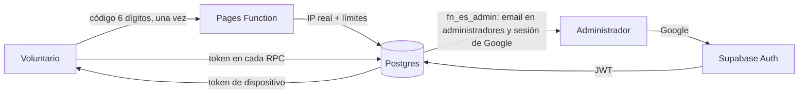

# 11 · Seguridad y privacidad — Mapa de hidrantes

| | |
|---|---|
| **Estado** | Vivo. Se actualiza con cada revisión de seguridad y cada petición de derechos atendida. |
| **Versión** | 1.3 — 23 de septiembre de 2026 (jefatura exige una sesión de Google, DEC-094; privacidad del incidente, la medición y la búsqueda, §6.1, DEC-089). 1.2 — 21 de septiembre de 2026 (checklist de intrusión ejecutada y automatizada) |
| **Propietario de** | el modelo de acceso y amenazas, la protección del código, RLS y permisos, qué datos personales se guardan y por qué, retención, el procedimiento del derecho de supresión, y el aviso legal. |
| **Para** | jefatura (que es la responsable del tratamiento) y construcción. Escrito para tenerlo **antes** de que alguien pregunte. |
| **Referencias** | las cifras medibles están en **03** §5–7; los campos en **05**; la infraestructura en **04**. |

---

## 1. Qué hay que proteger y de quién

| Activo | Valor | Amenaza realista | Consecuencia |
|---|---|---|---|
| Nombres y apellidos de los ~65 voluntarios | dato personal (RGPD) | exposición a terceros; a otros voluntarios | daño reputacional, incumplimiento |
| Integridad del mapa | operativa | vandalismo de datos con el código filtrado | información falsa en un servicio de emergencia |
| Cuota gratuita de Storage (1 GB) | disponibilidad | relleno con basura usando la clave pública | la app deja de aceptar fotos |
| Cuenta de administrador | control | correo comprometido | aprobaciones falsas, borrados |
| Secretos de servidor (`service_role`, sal, token de GitHub) | control total de los datos | filtración por el frontend o el repositorio | todo lo anterior |
| Continuidad | disponibilidad a largo plazo | dependencia de una persona | el sistema queda huérfano |

Las **ubicaciones de hidrantes no son datos personales** ni secretos: son infraestructura pública.
El daño posible de una filtración del código es vandalismo de datos, y toda escritura pasa por
moderación. Eso dimensiona el resto.

---

## 2. Modelo de acceso

| Principio | Cómo se aplica |
|---|---|
| El navegador nunca escribe directamente | toda mutación es una RPC `SECURITY DEFINER` que valida, escribe y registra (04 §3) |
| RLS es la única puerta | `anon` sin acceso a tablas ni vistas; `authenticated` solo con `fn_es_admin()`; matriz en 05 §5 |
| Identidad de dispositivo, no de nombre | propiedad de propuestas contra `dispositivo_id`; el nombre es atribución |
| Los nombres solo los ve jefatura (FR-27) | `anon` no lee `propuestas` ni `registro`; `fn_listar_puntos`, `fn_ficha_punto` y `fn_mis_propuestas` no devuelven autores ni `revisada_por`; las notificaciones y exportaciones no llevan nombres; test pgTAP y comprobación de red (AC-21, AC-134) |
| Mínimo privilegio en secretos | la `service_role key` solo en las Pages Functions y en CI; el frontend solo tiene la `anon key` |
| Permisos propios | `hidrantes.administradores`, independiente de la app de uniformidad; arranca solo con el propietario |
| Jefatura es correo **y** Google | `fn_es_admin()` exige que el correo del JWT esté activo en `administradores`, que `app_metadata.providers` contenga `google` y que la sesión se abriera con OAuth (`amr` con `method = 'oauth'`). Una cuenta de Auth con contraseña y el correo de un administrador no es jefatura: el proyecto se comparte con uniformidad, que admite registro por correo (DEC-094, `npm run comprobar-auth`) |
| Menos es más seguro | no se guardan DNI, teléfono, correo ni dirección de nadie |

---

## 3. Protección del código de acceso

Jefatura ha fijado 6 dígitos (DEC-004): un millón de combinaciones, poco si se puede probar sin
límite. Cinco capas, y por qué no basta con la primera:

1. **Límite por dispositivo (10/h).** Insuficiente solo: el `dispositivo_id` lo genera el móvil y un
   atacante cambia de uuid en cada intento.
2. **Límite por IP real (30/h).** No se puede leer `x-forwarded-for` en Postgres porque el cliente lo
   falsifica. La Pages Function de Cloudflare ve `CF-Connecting-IP`, que el cliente no puede alterar,
   y es la única capa que conoce la IP; la guarda como `sha256(SAL_IP + ip)`, nunca en claro. En
   IPv6 el límite "por IP" es **por /64** (los cuatro primeros grupos): un atacante rota direcciones
   dentro de su /64 con facilidad (RV-14). Una IPv4 mapeada cuenta como la IPv4, también escrita en
   hexadecimal (`::ffff:c000:201`); algo con forma de IPv6 imposible (dos `::`, más de 8 grupos) va a un
   cubo propio, `invalida`, que no se mezcla con ninguna IP de verdad. Una petición bloqueada deja como
   mucho una fila por IP, tope y minuto en `intentos_codigo` (0026, docs/18 RV-48).
3. **Techo global (200/h).** Nadie lo esquiva cambiando de identidad. A ese ritmo, el millón de
   combinaciones lleva unos 208 días, y Salud del sistema y la vigilancia diaria avisan mucho antes
   (más de 300 fallos en 24 h, o cualquier bloqueo de todo el grupo: RV-14). La cuenta va bajo un
   bloqueo, así que peticiones en paralelo no lo pasan. El techo se puede usar para dejar sin
   entrar a los voluntarios con móvil nuevo mientras dure el ataque; la defensa completa
   (Turnstile o una regla de Cloudflare) queda para una decisión (`docs/17` §12).
3b. **Tope de canjes buenos (150 por IP y día, 150 por hora en total).** Quien tenga el código no
   puede crear dispositivos sin fin para saltarse las cuotas por dispositivo. Los valores cubren la
   sesión presencial de 65 personas en la misma wifi (DEC-086).
4. **Token de dispositivo.** Tras el primer canje, el móvil usa un token aleatorio de 32 bytes (se
   guarda su hash); el código no vuelve a viajar. Los 65 voluntarios dejan de tocar el sistema de
   intentos, así que activar el techo global no deja a nadie fuera.
5. **Nadie salta la Function.** `fn_verificar_codigo` no tiene `execute` para `anon` ni
   `authenticated`; solo la llama la Function con `service_role`. Test pgTAP.

Además: tiempo de respuesta constante (no filtra por duración), rotación en un minuto desde
Ajustes con elección entre cerrar accesos nuevos o revocar todos los dispositivos (FR-34), y
caducidad del token a los 365 días sin uso.

**Qué hacer si el código se ha filtrado:** Ajustes → Código de acceso → marcar *Revocar todos los
dispositivos* → Generar uno nuevo → confirmar → comunicar el nuevo por el canal habitual. Revisar en
la cola las propuestas de las últimas horas antes de aprobar nada. Procedimiento detallado en 13.

---

## 4. Fotos y almacenamiento

- La `anon key` **no puede escribir** en el bucket. Subida solo con URL firmada que emite la Pages
  Function tras validar el token y la cuota (40 por dispositivo y día); nombre de archivo asignado
  por el servidor; 5 MB; solo JPEG/WebP (04 §7).
- **Lectura pública** por URL no enumerable (uuid). Decisión consciente (DEC-011): las URL firmadas
  de lectura romperían la caché offline. La foto retrata un hidrante; **14** pide no fotografiar
  personas ni matrículas, y jefatura rechaza cualquier foto que las incluya.
- **Metadatos EXIF eliminados** en el móvil por la recompresión (posición, modelo, fecha). Las
  coordenadas EXIF se envían aparte como dato del punto, no de la persona.
- Purga semanal de fotos huérfanas; una foto referenciada por un punto nunca se borra.

---

## 5. Revisión de seguridad (checklist)

Se ejecuta en la Fase 8 y en cada cambio del modelo de permisos, con la **`anon key`** desde un
cliente externo. Las ocho deben fallar. Resultado en la tabla, con fecha.

La ejecuta `npm run intrusion` contra la pila local (Supabase local y `wrangler pages dev`, nunca
dev ni prod), y `ci-sql` la repite en cada PR: si alguna dejara de fallar, la rama se queda en rojo.
`npm run intrusion -- --anotar` rellena las dos últimas columnas de esta tabla con la fecha del día.
Lo que mira es lo que contestan PostgREST, Storage y las Pages Functions a un cliente cualquiera;
los permisos vistos desde dentro de Postgres los cubre pgTAP (`supabase/tests`).

| # | Prueba | Esperado | Última ejecución | Resultado |
|---|---|---|---|---|
| 1 | `select` sobre `propuestas` | *permission denied* / 0 filas | 2026-09-21 | ✅ 401 · 42501: permission denied for table propuestas |
| 2 | `select` sobre `registro` | ídem | 2026-09-21 | ✅ 401 · 42501: permission denied for table registro |
| 3 | `insert`/`update` en `puntos` | ídem | 2026-09-21 | ✅ insert 401 · 42501: permission denied for table puntos; update 401 · 42501: permission denied for table puntos |
| 4 | llamar a `fn_aprobar` | *permission denied* con la `anon key`; `NO_AUTORIZADO` con una sesión que no sea de jefatura | 2026-09-21 | ✅ 401 · 42501: permission denied for function fn_aprobar |
| 5 | `fn_mis_propuestas` con token de otro dispositivo | 0 filas ajenas | 2026-09-21 | ✅ 0 filas ajenas, ninguna suya |
| 6 | llamar a `fn_verificar_codigo` directamente | *permission denied* | 2026-09-21 | ✅ 401 · 42501: permission denied for function fn_verificar_codigo |
| 7 | subir un archivo al bucket sin URL firmada | 403, o el 400 *AccessDenied* de Storage | 2026-09-21 | ✅ 400 · AccessDenied: new row violates row-level security policy |
| 8 | `GET /api/direccion` sin JWT de administrador | 403 | 2026-09-21 | ✅ 403 · NO_AUTORIZADO |

Complementarias (TR-41–TR-47): 11 intentos → bloqueo; tiempo constante; sin código en el móvil;
sin secretos en el build; reserva 41 rechazada; `registro` inmutable; EXIF ausente.

---

## 6. Datos personales

### 6.1 Qué se guarda de cada voluntario, dónde y por qué

| Dato | Dónde | Finalidad | Quién lo ve |
|---|---|---|---|
| Nombre y apellido | `propuestas.autor_*`, `registro.actor` | saber a quién preguntar cuando un dato no cuadra; auditoría | solo administradores (panel); **nunca** otros voluntarios ni ninguna respuesta de red dirigida a un voluntario |
| `dispositivo_id` (uuid aleatorio) | `propuestas`, `dispositivos`, `registro`, `subidas`, `incidencias_app`, `errores_cliente`, `intentos_codigo` | propiedad de propuestas, cuotas, anonimización | administradores; no identifica al hardware ni a la persona |
| Hash de IP con sal | `intentos_codigo` | límite de intentos | nadie (se purga a las 24 h) |
| Coordenadas GPS del móvil en el momento de una propuesta | `propuestas.gps_geom`, `precision_gps_m` | señal de fiabilidad para jefatura | administradores |
| Descripción libre de incidencias | `incidencias_app` | soporte | administradores |
| Correo de Google | `administradores`, `registro.actor`, `propuestas.revisada_por` | acceso y auditoría de administradores | administradores |
| Suscripción push (endpoint y claves del navegador) | `suscripciones_push` | avisar del resultado de una propuesta (voluntario) o de propuestas nuevas (jefatura); **solo si la persona lo activa** | nadie la lee; se borra al desactivar o tras tres fallos |

**Funciones de mapa para emergencias (FR-72 a FR-76, DEC-089):** el punto de incidente, la
medición y la posición del móvil **nunca salen del móvil** (DEC-062 §8) y no se guardan en IndexedDB
ni en la base de datos. El incidente puede ir en la URL (`?incidente=lat,lng`, y si el origen es el GPS también
`&gps=<momento>,<precisión>`, RV-59) y en `sessionStorage`, para sobrevivir a una recarga; se pierde al cerrar la pestaña. Lo único que sale es
el texto de una búsqueda con número de portal, hacia `/api/geocodificar` y de ahí a CartoCiudad
(DEC-092): la Function no lo registra en logs ni en `errores_cliente`, y lo guarda en caché solo como
`sha256` del texto normalizado. Compartir (FR-75) usa el menú del móvil: lo compartido nunca lleva
nombres ni la descripción libre (FR-27), y no pasa por ningún servidor nuestro.

**Los logs de GitHub Actions son públicos** (repositorio público, DEC-053). Un error de psql de una
violación de `check` o `not null` trae `DETAIL: Failing row contains (…)` con la fila entera, nombres
de voluntarios incluidos. Por eso, en Actions, `psql` corre siempre con `VERBOSITY=terse`, y todo
error de un proceso que un script imprime pasa por `errorSeguro`, que quita DETAIL, CONTEXT, QUERY y
cualquier "Failing row contains". Un test comprueba que ningún script lo imprime en crudo (docs/19
RV-53). `promover-piloto` enseña el error completo solo en local y con `--detalle`.

**No se guardan:** DNI, teléfono, correo de voluntarios, dirección postal, fecha de nacimiento,
fotos de personas. No hay cookies de terceros ni analítica externa; los errores se registran en el
propio sistema sin datos más allá del `dispositivo_id`.

### 6.2 Base jurídica y responsable

- **Responsable del tratamiento:** la Agrupación de Voluntarios de Protección Civil de Albolote,
  representada por su jefatura.
- **Finalidad:** mantener el inventario de puntos de agua para la protección civil, con trazabilidad
  de quién aportó cada dato.
- **Base jurídica:** interés legítimo de la agrupación en el ejercicio de su función (y, para los
  voluntarios, su relación con la agrupación). El nombre se pide con información clara en la
  pantalla de entrada y en el aviso legal.
- **Destinatarios:** ninguno externo. Proveedores técnicos (Supabase, Cloudflare, GitHub) actúan
  como encargados; las coordenadas de los hidrantes —no datos personales— se envían a Nominatim
  (OpenStreetMap) para deducir direcciones, sin datos del voluntario ni su IP.
- **Titularidad de los datos:** los genera la agrupación en el ejercicio de su función y son suyos.
  Si el ayuntamiento, el consorcio de bomberos u otro organismo los solicita, jefatura decide qué se
  comparte y cómo; la exportación de la segunda fase (16) existe para eso, sin dar acceso al sistema.

**Notificaciones push (FR-163–164):** el texto nunca incluye nombres de otros voluntarios; el
mensaje viaja cifrado al servicio push del navegador (Google, Apple o Mozilla), que no puede leerlo;
la suscripción es revocable desde Ajustes. **Exportaciones (FR-160):** contienen datos de hidrantes,
no de personas; quien las comparte fuera de la agrupación decide a quién; el Registro guarda quién
exportó y cuándo.

### 6.3 Retención

| Dato | Plazo | Motivo |
|---|---|---|
| `registro` | indefinido | es la auditoría; los nombres que contiene son "quién hizo qué", su finalidad legítima |
| `propuestas` | indefinido (historial) | trazabilidad del mapa |
| `intentos_codigo` | 24 h | solo sirve para el límite |
| `errores_cliente` | 90 días | soporte |
| tokens de dispositivo | 365 días sin uso | caducidad |
| papelera | 30 días | recuperación |
| respaldos | 90 días, cifrados, fuera de Git | recuperación; el historial de Git es imposible de purgar |

### 6.4 Derechos: acceso, rectificación, supresión

- **Acceso:** jefatura exporta desde el panel (Voluntarios → actividad + Registro filtrado por el
  dispositivo) lo que consta de esa persona y se lo entrega.
- **Rectificación:** el nombre se corrige desde Ajustes en el móvil (afecta a lo nuevo); para lo
  anterior, jefatura lo pide a construcción como corrección puntual anotada en `registro`.
- **Supresión:** se **anonimiza, no se borra**. Borrar la fila destruiría la auditoría de un cambio
  que sigue existiendo en el mapa; sustituir el nombre cumple la petición sin romper la
  trazabilidad. Se identifica a la persona **por su dispositivo**, no por nombre, porque los nombres
  se repiten entre 65 personas.

  Procedimiento (13 lo repite paso a paso):
  1. La persona lo pide a jefatura por el canal habitual; jefatura anota fecha.
  2. Panel → Voluntarios → localizar su fila (nombre + última actividad) → confirmar con ella que
     es su móvil.
  3. *Anonimizar…* → confirmar. `fn_anonimizar_autor(dispositivo_id)` sustituye nombre y apellido
     por "voluntario dado de baja" en `propuestas` y `registro`; conserva las filas y el
     `dispositivo_id`. El registro sigue siendo de solo añadir: con la anonimización activa, el
     trigger solo deja cambiar `actor`, y solo al texto exacto "voluntario dado de baja" (RV-26).
  4. Si tenía el móvil registrado, en Ajustes del móvil → Cerrar sesión. Su token caduca; no se
     revoca a los demás.
  5. Anotar la atención en `registro` (lo hace la RPC: `anonimizacion`) y en la tabla de §8.
  6. Los respaldos anteriores a la fecha conservan el nombre hasta que caducan (90 días); se
     informa de ello a la persona.

---

## 7. Aviso legal (texto para la aplicación)

Enlazado desde la pantalla de entrada y desde Ajustes. Texto breve y legible:

> **Mapa de hidrantes — aviso legal y privacidad**
>
> Esta aplicación la usa la Agrupación de Voluntarios de Protección Civil de Albolote para mantener
> el inventario de hidrantes y bocas de riego del término municipal y de Calicasas.
>
> **Qué guardamos de ti.** Tu nombre y apellido, para saber quién aportó cada dato, y un
> identificador aleatorio de tu móvil, para reconocer tus propias propuestas. No guardamos tu
> teléfono, correo, DNI ni dirección. Tu nombre solo lo ve la jefatura; nunca otros voluntarios.
>
> **Ubicación y fotos.** Al proponer un punto se guarda la posición del punto y, como referencia
> para jefatura, la de tu móvil en ese momento. Las fotos se guardan sin metadatos. No fotografíes
> personas ni matrículas: el objeto de la foto es el hidrante.
>
> **Cuánto tiempo.** El historial de cambios se conserva mientras exista el inventario, porque es
> el registro de quién hizo qué. Si dejas la agrupación y quieres que tu nombre desaparezca,
> pídelo a jefatura: lo sustituimos por "voluntario dado de baja" conservando los datos del
> hidrante.
>
> **Tus derechos.** Puedes pedir a jefatura ver, corregir o anonimizar lo que consta de ti. La
> responsable del tratamiento es la agrupación, representada por su jefatura.
>
> **Datos externos.** Para deducir direcciones se consulta OpenStreetMap con las coordenadas del
> hidrante, nunca con datos tuyos. Mapa base y direcciones © OpenStreetMap contributors.

Versión corta para el grupo (la comparte jefatura al repartir el código): "La app guarda tu nombre
y apellido para saber quién propuso cada dato, y solo lo ve jefatura. No guarda tu teléfono ni tu
correo. Si algún día quieres que tu nombre desaparezca, pídelo y lo anonimizamos."

---

## 8. Registro de peticiones y revisiones

| Fecha | Tipo (revisión de seguridad / acceso / rectificación / supresión / incidente) | Detalle | Atendido por | Cerrado |
|---|---|---|---|---|
| | | | | |

---

## 9. Riesgos de seguridad y su mitigación

| Riesgo | Mitigación |
|---|---|
| El código circula fuera del grupo | Ubicaciones no personales; toda escritura moderada; rotación en un minuto; límites de intentos. |
| Fuerza bruta sobre 6 dígitos | Las cinco capas de §3. |
| Esquivar el límite con `dispositivo_id` nuevos o `x-forwarded-for` falso | Límite por `CF-Connecting-IP` en la Function + techo global. |
| El techo global deja fuera a los 65 | Token de dispositivo: quien entró no vuelve a pasar por el control. |
| Llenar Storage con la `anon key` | Sin escritura para `anon`; URL firmada con cuota. |
| Filtración de la `service_role key` | Solo en variables cifradas de Cloudflare y en GitHub Environments; nunca en el frontend ni en el repositorio; rotar = relanzar `arranque.ts`. |
| Cuenta de Google de un administrador comprometida | Desactivación inmediata desde Ajustes por otro administrador; registro de todo lo que hizo; 2FA obligatorio en las cuentas de jefatura (13). |
| Nombres de voluntarios expuestos a otros voluntarios | RLS: `anon` no lee tablas; `fn_ficha_punto` y `fn_listar_puntos` no incluyen autores; comprobado en la respuesta de red (AC-21). |
| Nombres para siempre en Git | Respaldos como artefactos cifrados con caducidad; seed sin nombres reales. |
| Fotos con personas o matrículas | Instrucción en 14; rechazo en la cola con motivo; lectura pública por URL no enumerable. |
| Un voluntario con el mismo nombre que otro es anonimizado por error | Anonimización por `dispositivo_id`, nunca por nombre. |
| Dependencia de una sola persona | Cuentas institucionales, credenciales custodiadas, comprobación anual (15). |

---

## Trazabilidad

| Sección | Origen |
|---|---|
| 2–3 | plan v2.1 "Principios", "Protección del código de acceso" |
| 4 | plan v2.1 Fase 2 "Storage", Fase 6 |
| 5 | plan v2.1 Fase 8 "Revisión de seguridad" |
| 6–7 | plan v2.1 "Privacidad y datos personales"; requisitos v6.1 §4 |
| 9 | plan v2.1 "Riesgos" (los de seguridad) |
