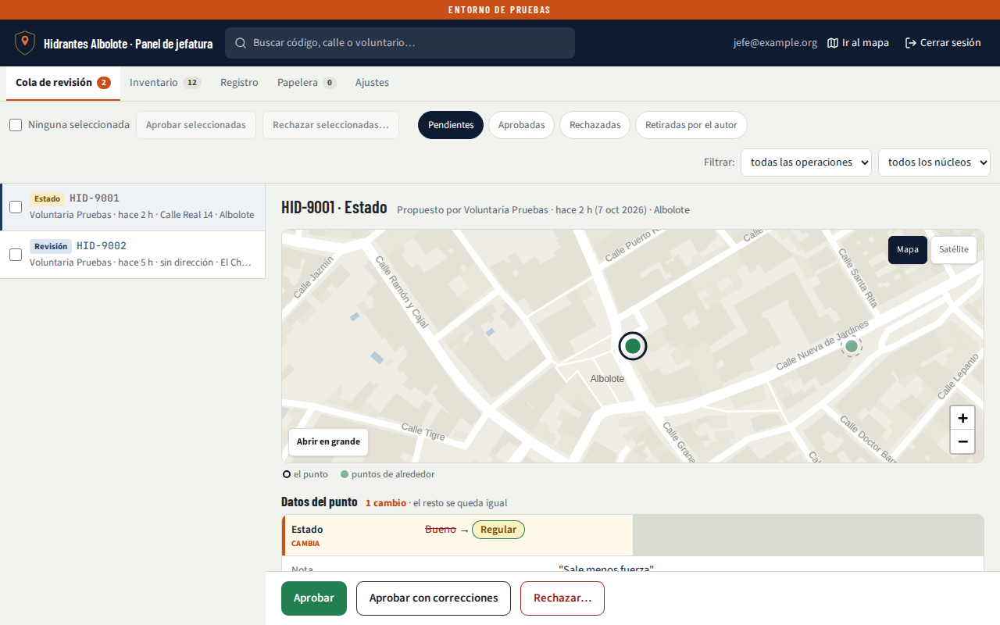
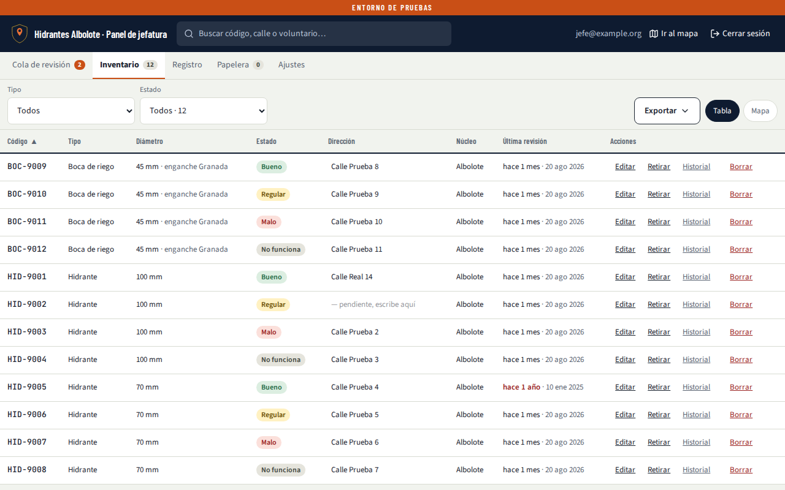
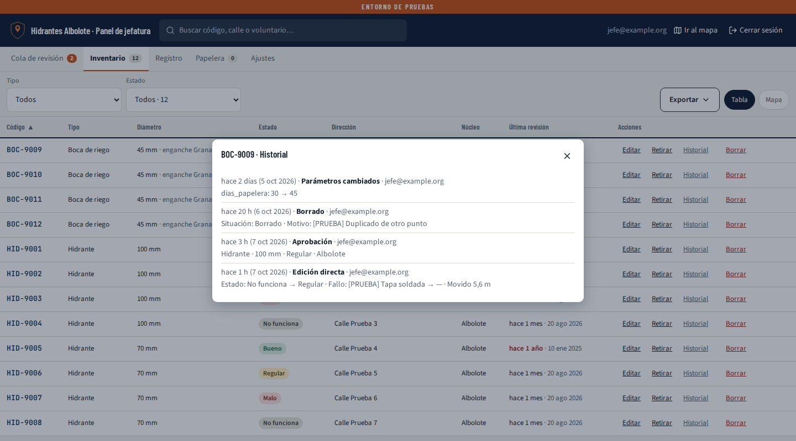
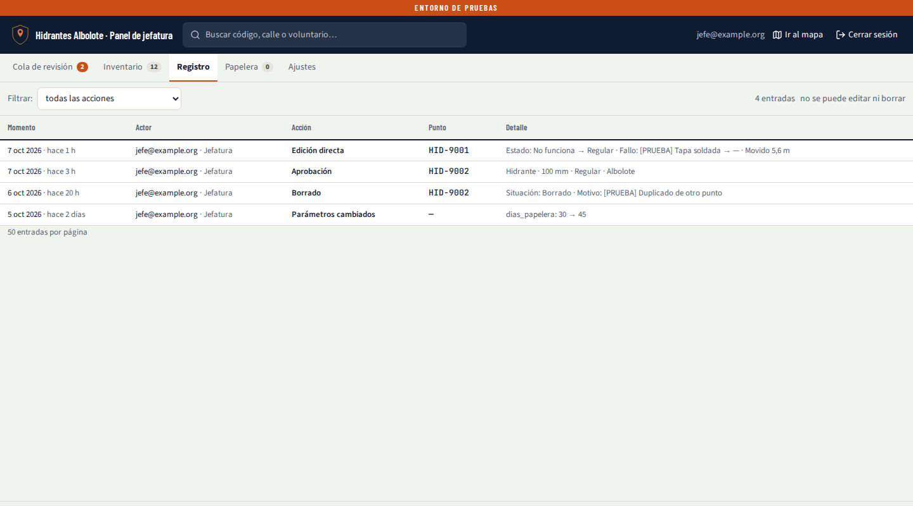
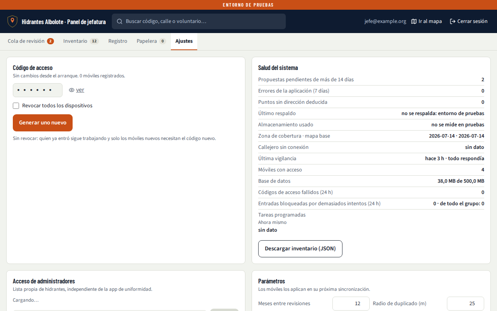

# 13 · Manual de jefatura — Mapa de hidrantes

| | |
|---|---|
| **Estado** | **Borrador, se revisa tras el piloto** (DEC-041, `docs/31` RV-139). |
| **Versión** | 0.1 — 7 de octubre de 2026. Primer borrador completo, con el panel de la versión 0.9 (cinco pestañas) y las capturas de `capturas/vistas/`. |
| **Para** | Jefatura y los administradores del panel. |
| **Se apoya en** | 02 (los pasos, FL-20 a FL-38), 01 (las reglas), 11 (datos personales) y 15 (qué hacer si algo falla). Si este manual y esos documentos dicen cosas distintas, mandan ellos, y este manual se corrige. |

Las capturas son de pruebas: llevan la banda naranja **ENTORNO DE PRUEBAS** y datos inventados
(«[PRUEBA]», «Voluntaria Pruebas», `jefe@example.org`). En producción no sale esa banda.

Todo lo que el voluntario hace en el móvil está en el manual del voluntario (14). Este manual
cuenta lo que es solo de jefatura.

---

## 1. Qué hace jefatura

- **Revisar** lo que proponen los voluntarios: nada cambia en el mapa de todos sin vuestra
  aprobación.
- **Mantener el inventario**: editar, retirar o borrar puntos directamente.
- **Dar acceso**: el código de acceso del grupo y la lista de administradores.
- **Vigilar** que el sistema está sano (Salud del sistema) y avisar al responsable técnico si no.

## 2. Entrar

- **En el ordenador:** abre la app → *¿Eres de jefatura? Entrar con Google* (o la dirección del
  panel) → tu cuenta de Google. Si tu correo no está en la lista de administradores, verás «No
  autorizado».
- **En el móvil:** entra igual, con Google. Ves el mapa de los voluntarios con la etiqueta
  **Jefatura** arriba. Al tocar *Jefatura* (o *Ajustes → Panel de jefatura*) se abre el panel; *Ir
  al mapa* o «atrás» te devuelven.
- **Cerrar sesión**, arriba a la derecha.

Desde el móvil, como jefatura, cualquier operación sobre un punto **se aplica al momento**: el botón
dice *Aplicar ahora* y el cambio no pasa por la cola. Queda en el Registro como acción de
administrador.

## 3. El panel

Cinco pestañas: **Cola de revisión**, **Inventario**, **Registro**, **Papelera** y **Ajustes**. Cola de
revisión, Inventario y Papelera llevan al lado cuántas cosas tienen. La búsqueda de arriba encuentra por código, calle
o voluntario.

## 4. Cola de revisión

A la izquierda, las propuestas; a la derecha, la elegida:

- el **mapa** con el punto y los de alrededor (*Abrir en grande*, *Mapa* / *Satélite*);
- **Datos del punto**: todos los campos, con lo que cambia marcado («Bueno → Regular»);
- las **fotos** (Conexión y Sitio) y la dirección deducida, que se puede corregir ahí mismo.

**Decidir:**

- **Aprobar.**
- **Aprobar con correcciones:** cambias lo que haga falta y *Guardar y aprobar*. Un hidrante con
  «otra medida» de diámetro hay que dejarlo en 70 o 100 antes de aprobarlo; una boca de riego se
  aprueba tal cual.
- **Rechazar…:** el motivo es obligatorio. El voluntario lo verá.
- **Fusionar** (solo si sale como posible duplicado, a menos de 25 m de otro): eliges campo a campo
  qué se queda. No se crea un punto nuevo.
- Si el punto cambió después de la propuesta, el botón pasa a *Confirmar y aprobar* y el panel lo
  explica.

**En bloque:** marca las casillas (o *todas*) → **Aprobar seleccionadas**. Lo típico: filtrar por
*revisiones* («sigue igual») y aprobarlas de golpe. El panel dice cuántas se aprobaron y cuáles se
quedaron fuera, y por qué.

**Historial:** los botones *Aprobadas*, *Rechazadas* y *Retiradas por el autor* enseñan lo ya
decidido, en solo lectura, con quién y por qué.

Los filtros de arriba a la derecha separan por operación y por núcleo.

## 5. Inventario

- **Tipo** y **Estado** filtran; cada columna se ordena tocando su título. *Última revisión* en rojo
  («hace 1 año») es lo caducado: lo que conviene mandar a revisar.
- **Tabla** o **Mapa**, a la derecha.
- **Exportar ▾**: Excel, CSV o GeoJSON, con los filtros aplicados. El archivo se genera en tu
  navegador. Para bomberos o el ayuntamiento. Queda en el Registro.

**Sobre cada punto:**

- **Editar:** se abre al lado (a pantalla completa en el móvil), con el mapa y lo que cambias
  marcado. Puedes mover el punto y cambiar diámetro, enganche, estado, fallo, dirección y
  descripción; el tipo no. *Guardar cambios* se aplica al momento.
- **Retirar:** el punto existió y ya no está (obras, asfaltado). Pide motivo y se conserva su
  historia.
- **Historial:** todo lo que ha pasado con ese punto, dicho con palabras.

  

- **Borrar:** el punto nunca debió existir (un error, un duplicado). Pide motivo y va a la
  **Papelera**.
- **Dirección:** se escribe en la propia celda («— pendiente, escribe aquí»).

**Retirar o borrar:** si el hidrante estaba y lo quitaron, *Retirar*. Si nunca existió, *Borrar*.

## 6. Registro

Todo lo que se ha hecho: cuándo, quién, qué acción, sobre qué punto y qué cambió. Se filtra por tipo
de acción. **No se puede editar ni borrar.** Sirve para responder a «¿quién cambió esto y cuándo?».

## 7. Papelera

Los puntos borrados se guardan los días que diga *Ajustes → Parámetros → Días de papelera* (30 por
defecto). **Restaurar** los devuelve al mapa. Pasado ese plazo se purgan solos; *Purgar lo
caducado…* lo hace ya, y **no se puede deshacer**.

## 8. Ajustes

### Código de acceso

El código de seis cifras con el que entran los voluntarios.

1. Decide si marcas **Revocar todos los dispositivos**:
   - **sin marcar**: quien ya entró sigue trabajando; solo los móviles nuevos necesitan el código
     nuevo;
   - **marcado**: todos vuelven a teclearlo. Es lo que se usa **si el código se ha filtrado**. La
     entrada se abre sola 24 horas para que todos puedan volver a entrar (abajo).
2. **Generar uno nuevo** → **Generar y poner en vigor**.
3. Pásalo al grupo por el canal habitual. Nunca en un sitio público.

#### La entrada (el día del lanzamiento)

Para que un código filtrado no sirva para mucho, la app deja entrar a pocos móviles a la vez: 20 al
día desde una misma wifi y 40 por hora entre todos. Cuando entra todo el grupo de golpe (el día del
lanzamiento, en una reunión con la wifi de la sede, o después de cambiar el código revocando),
eso se queda corto.

- **Abrir la entrada para todos (24 h)**, en *Código de acceso*: durante 24 horas entran todos los
  que tengan el código, desde la misma wifi si hace falta. Quien pruebe códigos al azar sigue frenado
  igual.
- Abierta, sale una franja verde con **hasta cuándo** y el botón **Cerrar ahora**. Si no, se cierra
  sola al pasar la hora.
- **El día del lanzamiento: ábrela antes de pasar el código al grupo.**
- Si *Salud del sistema* dice que hay **entradas frenadas por el tope**, alguien con el código bueno
  se ha quedado fuera: ábrela desde ahí.
- Abrirla y cerrarla queda en el *Registro*.

### Acceso de administradores

Escribe el correo y **Añadir**; para quitar a alguien, apaga su interruptor. El último administrador
activo no se puede quitar. No hace falta tocar nada técnico.

### Parámetros

Meses entre revisiones, radio de duplicado, días de papelera, margen de la zona, fotos por móvil y
día, tramo de manguera, radios de marcador y los dos topes de entrada («Entradas desde una misma
wifi al día» y «Entradas por hora, entre todos»; para un día puntual es mejor abrir la entrada 24 h
que subirlos). **Guardar cambios**; los móviles los aplican en su
siguiente sincronización. Si no sabes qué hace uno, déjalo como está.

### Núcleos

Los barrios y pueblos de la zona, sacados de OpenStreetMap. Se puede renombrar uno o añadir el que
falte.

### Salud del sistema

Una lista de comprobaciones. Lo que hay que mirar:

| Fila | Bien | Avisa al responsable técnico si… |
|---|---|---|
| Propuestas pendientes de más de 14 días | 0 | crece: hay que revisar la cola |
| Errores de la aplicación (7 días) | 0 o pocos | sube de golpe |
| Último respaldo | de esta semana | tiene más de una semana |
| Última vigilancia | «todo respondía» | dice «con avisos» o «lleva más de un día sin pasar» |
| Almacenamiento usado | lejos del límite | se acerca a 1 GB (15 §5.7) |
| Códigos de acceso fallidos / entradas bloqueadas | 0 o pocos | hay muchos: alguien prueba códigos (15 §5.4) |

*Descargar inventario (JSON)* es una copia de consulta. El respaldo de verdad es automático (15).

### Mantenimiento

*Regenerar zona de cobertura*, *Regenerar mapa base*, *Respaldo ahora* y *Purgar fotos huérfanas*.
Se ejecutan fuera de la aplicación y tardan unos minutos; el resultado sale en Salud del sistema y en
el Registro. En el uso normal no hace falta tocarlos.

### Avisos para jefatura

Notificaciones en este navegador, apagadas por defecto: **Nuevas propuestas pendientes** (como mucho
una por hora) y **Resumen semanal** (los lunes: revisiones caducadas y pendientes antiguas). En
iPhone, solo con la app instalada.

### Código QR del enlace

Para la sede y las reuniones: **Imprimir A4** saca un cartel con el QR que abre la app. El cartel no
lleva el código de acceso.

### Novedades

Lo que cambió en las últimas versiones.

## 9. Datos personales

- Los voluntarios firman con nombre y apellido. **Solo jefatura los ve**, en la cola y en el
  Registro. No salen en exportaciones, ni en lo que se comparte, ni en nada que vea otro voluntario.
- Los correos de los administradores tampoco salen hacia los voluntarios.
- **Si un voluntario pide que se borre su nombre:** pásalo al responsable técnico, que lo anonimiza
  con un procedimiento propio (11; 15 §5.10). Ya no se hace desde el panel.
- No mandes capturas del panel con nombres por grupos de mensajería.

## 10. Rutinas

| Cuándo | Qué |
|---|---|
| Cada pocos días | Vaciar la cola de revisión. Las *revisiones* se aprueban en bloque. |
| Cada mes | Inventario ordenado por *Última revisión*: mandar a revisar lo que sale en rojo, por el canal del grupo. |
| Cada mes | Mirar Salud del sistema (apartado 8). |
| Cuando alguien deja el grupo con un código que preocupa | Código nuevo, con o sin revocar (apartado 8). |
| Una vez al año | La comprobación de 15 §9, con el responsable técnico. |

## 11. Si algo va mal

El procedimiento de cada caso está en **15** (Continuidad y emergencias). Los más probables:

| Pasa esto | Mira |
|---|---|
| La app no carga o sale en blanco | 15 §5.1 |
| El código de acceso se ha filtrado | 15 §5.4: código nuevo **revocando** |
| Una cuenta de administrador puede estar comprometida | 15 §5.5: quitarla de *Acceso de administradores* |
| Se han perdido o estropeado datos | 15 §5.3: se restaura el respaldo |
| Supabase, Cloudflare o GitHub caídos | 15 §5.8: la app sigue abriendo con lo guardado en cada móvil |
| Un sábado por la tarde nadie conecta | Bloqueos durante el fútbol: lo pendiente sale solo al acabar |

> Pendiente de revisar tras el piloto: las dudas reales de jefatura en la validación (#76) y el
> piloto (#77), y los contactos de 15 §10.
