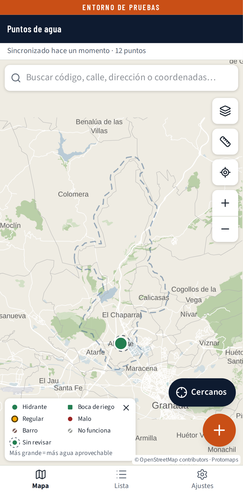
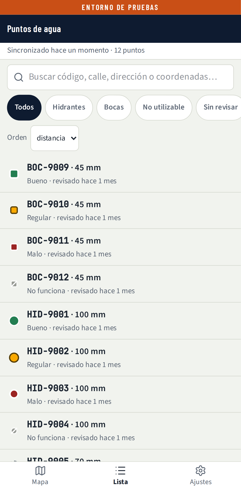
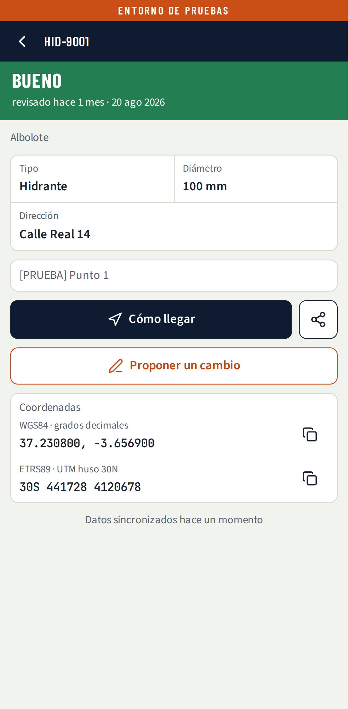
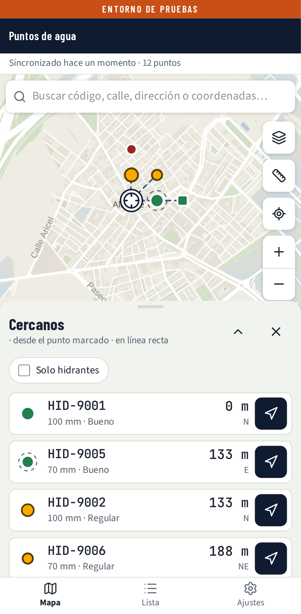
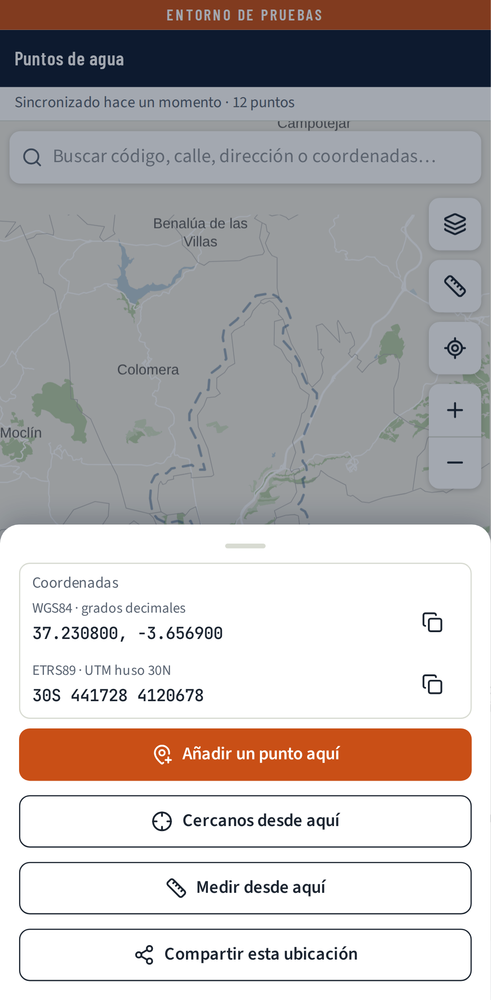
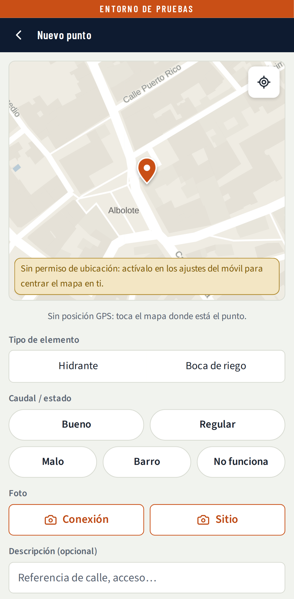
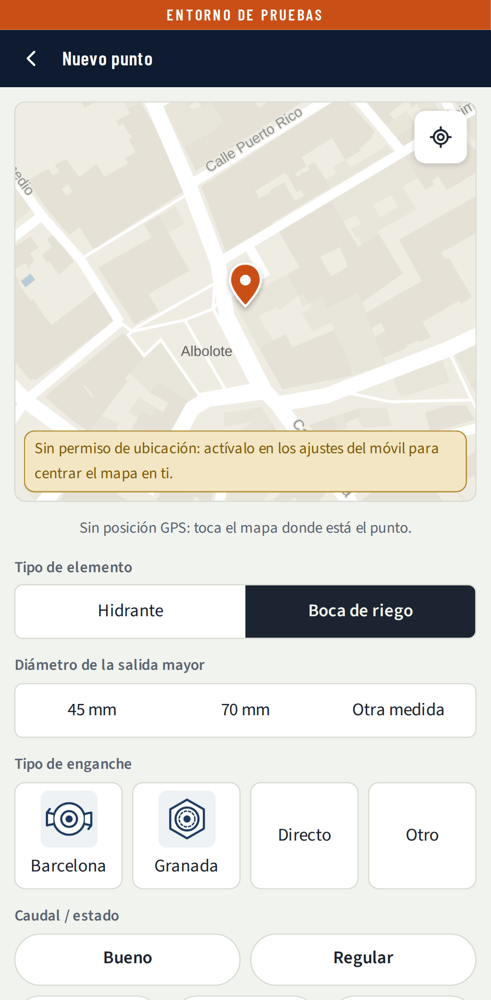
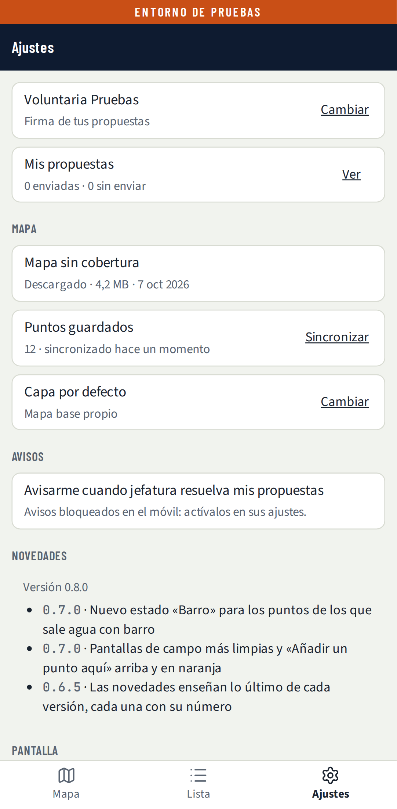

# 14 · Manual del voluntario — Mapa de hidrantes

| | |
|---|---|
| **Estado** | **Borrador, se revisa tras el piloto** (DEC-041, `docs/31` RV-139). |
| **Versión** | 0.1 — 7 de octubre de 2026. Primer borrador completo, con la app de la versión 0.8 y las capturas de `capturas/vistas/`. |
| **Para** | Los voluntarios de Protección Civil de Albolote. |
| **Se apoya en** | 02 (los pasos, FL-01 a FL-38), 01 (las reglas) y `notas-para-14-ios.md` (iPhone). Si este manual y 01 o 02 dicen cosas distintas, mandan 01 y 02, y este manual se corrige. |

Las capturas son de pruebas: llevan la banda naranja **ENTORNO DE PRUEBAS** y datos inventados
(«[PRUEBA]», «Voluntaria Pruebas»). En la app de verdad no sale esa banda.

---

## 1. Para qué sirve

La app es el mapa de los hidrantes y las bocas de riego de Albolote y Calicasas. Sirve para dos
cosas:

- **Encontrar agua deprisa** en una salida: el punto más cercano que funciona, cómo llegar y qué
  diámetro y enganche tiene.
- **Tener el mapa al día**: tú dices lo que ves en la calle y jefatura lo revisa antes de que cambie
  el mapa de todos.

Nada de lo que envías cambia el mapa directamente. **Todo pasa por jefatura.**

## 2. Instalar y entrar (la primera vez)

1. Abre el enlace que te pasa jefatura por el grupo.
2. **Instálala** antes de entrar:
   - **Android (Chrome):** toca el botón **Instalar** que ofrece la propia app (un aviso en el mapa y
     una fila en Ajustes). Si no aparece, menú ⋮ → *Instalar aplicación*.
   - **iPhone:** abre el enlace **con Safari** (desde Chrome o desde WhatsApp no sale la opción).
     Toca **Compartir** (el cuadrado con la flecha hacia arriba) → **Añadir a pantalla de inicio** →
     **Añadir**. Abre siempre la app desde ese icono.
3. Abre la app instalada y escribe el **código de acceso** del grupo (seis cifras) y tu **nombre y
   apellido**. Toca **Entrar**. El código no se vuelve a pedir en ese móvil.
4. Verás tres pantallas cortas: cómo se lee el mapa, cómo se añade un punto y que todo pasa por
   jefatura. Puedes saltarlas y volver a verlas desde Ajustes → *Cómo se usa*.
5. Si estás con wifi, la app descarga sola el mapa para usarlo sin cobertura y los puntos.

**En iPhone:** la app instalada y Safari no comparten datos. Instala primero y entra después. Si
pasas semanas sin abrirla, el iPhone puede borrar sus datos: la app te pedirá el código otra vez y
volverá a descargar todo.

**Si el código no entra:** «código incorrecto». Tras muchos intentos te pedirá esperar una hora.
Pide el código a jefatura; no lo compartas fuera del grupo.

## 3. El mapa

- Arriba, la barra dice cuándo se sincronizó y cuántos puntos hay. Sin cobertura dice «sin
  cobertura» y de cuándo son los datos.
- La línea discontinua es la **zona de cobertura**: Albolote y Calicasas.
- A la derecha: **capas**, **medir**, **centrar en mí** y el zoom.
- **Capas**, cada una con una miniatura: **Mapa sin conexión** (funciona sin cobertura),
  **Callejero** (con los nombres de las calles), **Foto aérea** (para ver el terreno) y **Catastro**
  (parcelas y edificios). Las tres últimas necesitan cobertura.
- Abajo: **Cercanos** (el punto que funciona más cerca) y el botón naranja **+** (añadir un punto).

**Cómo se lee un punto:**

| Lo que ves | Qué quiere decir |
|---|---|
| Círculo | Hidrante |
| Cuadrado | Boca de riego |
| Verde | Bueno |
| Amarillo | Regular |
| Rojo | Malo: se probó y sale débil |
| Marrón y tachado | Barro: sale agua con barro y no se puede usar |
| Gris y tachado | No funciona: no se pudo usar (tapa que no abre, válvula rota, arqueta enterrada) |
| Anillo de rayas alrededor | Sin revisar: hace más de un año que nadie lo comprueba |
| Más grande | Más agua aprovechable |

## 4. Buscar un punto y ver su ficha

Puedes encontrarlo de cuatro maneras: acercando el mapa, con **centrar en mí**, en la pestaña
**Lista** (ordenada por distancia) o con la **búsqueda** (código, calle, dirección o coordenadas).

Toca el punto o la fila y se abre su **ficha**:

- Arriba, en grande y con su color, **el estado** y cuándo se revisó.
- Tipo, diámetro, tipo de enganche (en las bocas), dirección, descripción y foto.
- **Cómo llegar** abre el mapa de tu móvil con el punto. La app no calcula rutas.
- **Compartir** (el botón de al lado) manda el punto por WhatsApp: código, estado, dirección,
  coordenadas y un enlace de Google Maps. Sin nombres.
- **Coordenadas** en dos sistemas (WGS84 y UTM ETRS89), cada una con su botón de copiar. Si
  bomberos te pide coordenadas, dale la que pida.
- **Proponer un cambio**: lo que hayas visto en la calle (apartado 6).

## 5. En una salida: el punto más cercano que funciona

1. Toca **Cercanos**. Con el GPS al día, el incidente es donde estás tú.
2. El mapa marca el sitio con una diana y traza líneas a los puntos más cercanos. Abajo, una lista
   con **como mucho cinco** puntos que funcionan (bueno o regular), con la distancia **en línea
   recta** y el rumbo (N, NE…).
3. El botón de cada fila es **Cómo llegar**. *Solo hidrantes* quita las bocas de riego.
4. **Atrás** cierra Cercanos.

**Si el incidente no es donde estás:**

- **Mantén pulsado** el mapa en el sitio (clic derecho en el ordenador). Se abre **¿Qué hay
  aquí?**:

  

  Desde ahí: *Añadir un punto aquí*, *Cercanos desde aquí*, *Medir desde aquí* o *Compartir esta
  ubicación*.
- O **busca la calle** («calle real», «avda andalucía»): funciona sin cobertura. Con número de
  portal hace falta cobertura; sin ella, la app te enseña la calle. También puedes pegar unas
  coordenadas o un enlace de Google Maps.

**Avisos que puedes ver en Cercanos:** «posición de hace N min» (el GPS dejó de responder) o
«posición poco precisa (±N m)»: en ese caso, mejor marca el sitio en el mapa.

**Medir el tendido:** botón **Medir** del mapa, o *Medir desde aquí*. Cada toque en el mapa añade un
vértice; abajo sale la distancia total y los tramos de manguera. *Deshacer*, *Borrar* y *Terminar*.
No se guarda.

## 6. Proponer un cambio

Desde la ficha → **Proponer un cambio**. Hay cinco cosas que puedes proponer sobre un punto que ya
existe, más el alta de uno nuevo:

| Operación | Cuándo | Qué te pide |
|---|---|---|
| **Sigue igual** | Lo has comprobado y está como dice la ficha | La foto de hoy |
| **Actualizar estado** | Funciona distinto (mejor o peor) | El estado de ahora y la foto; si no funciona, qué le pasa |
| **Corregir datos** | El diámetro, el enganche o la descripción están mal | Los datos buenos y la foto |
| **Corregir ubicación** | El punto está en otro sitio del mapa | Arrastrar el pin al sitio real y las dos fotos |
| **Proponer retirada** | Ya no existe (obras, asfaltado, sustituido) | El motivo y una foto del sitio |

El **tipo** (hidrante o boca) no se cambia: si está mal, propón la retirada y da de alta el correcto.

**Sigue igual** es la más útil: un punto revisado hace más de un año sale con el anillo de rayas.
Cuando pases al lado de uno, compruébalo y envía *Sigue igual*.

## 7. Dar de alta un punto nuevo

1. Toca el **+** naranja (o mantén pulsado el mapa → *Añadir un punto aquí*).
2. Ajusta el **pin** si el GPS no acierta. Si queda fuera de la zona, la app te avisa; puedes seguir.
3. Elige **Hidrante** o **Boca de riego**.
   - Hidrante: diámetro de la salida mayor, 70, 100 u otra medida.
   - Boca de riego: diámetro 45, 70 u otra medida, y el **tipo de enganche** (Barcelona, Granada,
     Directo u Otro). Los dibujos te ayudan a compararlo.
4. Elige el **caudal / estado**. Si es *No funciona*, escribe qué le pasa.
5. Haz las **dos fotos**: **Conexión** (la salida de agua) y **Sitio** (algo para encontrarlo: «al
   lado de la gasolinera»). Hasta que estén las dos, el botón te dice cuál falta.
6. Una descripción, si quieres, y **Enviar para revisión**.

Tu propuesta no sale en el mapa hasta que jefatura la aprueba. Si está a menos de 25 m de otro
punto, jefatura lo verá como posible duplicado; tú no tienes que hacer nada.

**Los estados que más se confunden, en una frase:**

- **Malo:** se probó y sale débil.
- **Barro:** sale agua con barro; no se puede usar.
- **No funciona:** no se pudo usar (tapa que no abre, válvula rota, arqueta enterrada o
  inaccesible).

> Pendiente de revisar tras el piloto: si hace falta una frase para Bueno y Regular (01 FR-18 solo
> define Malo, Barro y No funciona).

## 8. Sin cobertura

La app funciona igual sin cobertura: ves el mapa, buscas, abres fichas y propones cambios. Lo que
envías se guarda en el móvil, el botón dice *Guardar · se enviará con cobertura* y arriba aparece
**«N sin enviar»**. Cuando vuelve la señal, sale solo; un reintento nunca lo duplica.

Si algo lleva más de 24 horas sin salir, la app te lo dice. No cierres sesión con cosas sin enviar:
se perderían (la app te avisa antes).

**Si un sábado por la tarde no conecta, no es tu móvil:** durante los partidos de fútbol algunos
operadores bloquean el servidor. La app abre con lo guardado y dice «Sin conexión con el servidor»;
lo pendiente sale al acabar el bloqueo. Por eso conviene abrir la app con cobertura **antes** de
necesitarla.

## 9. Mis propuestas y avisos

- **Ajustes → Mis propuestas**: cada envío en una tarjeta. Arriba, el código del punto (o «Punto
  nuevo»), qué tipo de cambio es y su estado (pendiente, aprobada, rechazada). Debajo, **una línea
  con lo que propusiste**: «Regular → No funciona», «Tipo de enganche: Granada → Directo»,
  «Hidrante 100 mm» en un alta, «Sigue igual» en una revisión, «Retirada: Obras». Si jefatura la
  rechazó, «Motivo: …»; si la aprobó con correcciones, cuáles. También sale lo que sigue sin
  enviar. Una pendiente la puedes **retirar** con el botón de la tarjeta.
- Al abrir la app, un aviso te resume lo que jefatura ha resuelto desde la última vez.
- **Avisarme cuando jefatura resuelva mis propuestas**: notificaciones en el móvil. En iPhone solo
  funcionan con la app instalada y con iOS 16.4 o posterior. Al tocar una, se abre *Mis
  propuestas*.

## 10. Ajustes

- **Firma de tus propuestas → Cambiar**: si el móvil pasa a otra persona.
- **Mapa sin cobertura**, en una sola tarjeta: si el mapa está descargado y de cuándo (y
  *Actualizar* si hay versión nueva), cuántos puntos tienes guardados y cuándo se sincronizaron
  (*Sincronizar* trae los últimos cambios ya), y si el móvil puede borrar esos datos cuando le falta
  espacio (para que no, instala la aplicación).
- **Capa por defecto** y **modo oscuro**.
- **Novedades de la versión …**: lo nuevo de la versión que tienes; las de antes, en *Ver versiones anteriores*.
- **Cómo se usa**: las tres pantallas del principio.
- **Cerrar sesión en este móvil**: borra el acceso, el nombre y lo que quede sin enviar (te avisa).
- Cuando hay una versión nueva, la app dice **«hay una versión nueva, recargar»**. Tócalo; no hay que
  reinstalar.

## 11. Tus datos

La app guarda tu nombre y apellido para firmar tus propuestas. Solo los ve jefatura; ningún otro
voluntario ve quién envió qué, y no salen en exportaciones ni en lo que se comparte. Si dejas el
grupo y quieres que se borre, díselo a jefatura. El detalle está en *Ajustes → Aviso legal y privacidad*.

## 12. Si algo no va

| Pasa esto | Haz esto |
|---|---|
| Pide el código otra vez | Escríbelo; tu nombre ya está. Si no lo tienes, pídelo a jefatura (puede haberlo cambiado). |
| «Sin conexión con el servidor» | Sigue trabajando: se envía solo al volver. |
| «N sin enviar» no baja con cobertura | Ajustes → Puntos guardados → *Sincronizar*. Si sigue, avisa a jefatura. |
| El mapa sale en blanco sin cobertura | El mapa sin cobertura no está descargado: Ajustes → *Mapa sin cobertura*, con wifi. |
| No llegan las notificaciones | Revisa el permiso en los ajustes del móvil; en iPhone, que la app esté instalada. |
