# Recorrido corto de lo cambiado en staging · 9 oct 2026 (docs/33 RV-344, DEC-184)

| | |
|---|---|
| **Qué** | Solo lo que cambia `docs/33` (U1 a U15 y la entrada del lanzamiento, RV-338), recorrido como una persona en una ventana de Chrome visible en este PC (`headless: false`, `slowMo` 100 ms). |
| **Dónde** | App del voluntario: **staging real** (`hidrantes-albolote-staging.pages.dev`), `<meta name="commit">` = `9f6d7cc` (todo docs/33), última migración aplicada `0044`. Panel: el build de `9f6d7cc` con el modo de staging, servido en local con el servidor simulado de los e2e del panel (la entrada con Google no se automatiza), como en RV-270. |
| **Tamaños** | Móvil 412 × 915 y 360 × 800 (táctil, emulación de Pixel 7) y escritorio 1440 × 900, cada uno en claro y en oscuro (`colorScheme`). Panel: 1440 × 900, 412 × 915 y 720 × 450 (el zoom del 200 % de 1440 × 900), en claro y en oscuro. |
| **Capturas** | [`recorrido/2026-10-09/`](recorrido/2026-10-09/): 131 JPEG (5,2 MB). `mk-U*` son las «Propuesta» de [`docs/mockups/33-mejoras.html`](../mockups/33-mejoras.html), sacadas con Playwright; `u…` la app en staging (sufijo `m412`, `m360`, `e1440` y `claro`/`oscuro`); `p…` el panel simulado; `…-local-…` el build local. Antes de cada captura de página entera, `scrollTo(0, 0)` (RV-327). Solo datos de prueba (`[PRUEBA]`, firma ficticia «Prueba Recorrido», nombres ficticios del simulado y correos `example.org`). |
| **Resultado** | Contra staging, 79 pasos: 75 en verde y 4 saltados (U12 solo en el ordenador). En el panel simulado, 14 en verde; en local, 2. |

## Cómo, sin ver ningún secreto

- **Cadena de staging y sesión.** Con el orquestador de RV-139b (`--recorrido`): traspaso de `SUPABASE_DB_URL` de staging con clave efímera, descifrada solo en memoria (RV-208), ejecución del traspaso borrada; un token aleatorio de un dispositivo nuevo, comprobado con `fn_validar_token` y puesto en el almacenamiento local de cada contexto de Playwright por el entorno (`RV_TOKEN`, `RV_DISPOSITIVO`), nunca impreso ni escrito. Nadie tecleó ni leyó el código de acceso.
- **Lo único que se escribió en staging:** una propuesta de *Actualizar estado* (Bueno → Regular) sobre BOC-0007, un punto `[PRUEBA]`, para ver *Mis propuestas*. Las consultas a la base fueron de solo lectura (elegir el punto y comprobar que la propuesta llegó).
- **Versión nueva** (U4): no hay forma de desplegar otra versión sin tocar staging, así que se provocó **solo en el navegador del recorrido**: tras cargar la app, `navigator.serviceWorker.register('/sw.js?rv344=…')` instala el mismo Service Worker con otra URL y la app lo ve como versión nueva. El aviso salió en staging; si tapa *Enviar* al bajar del todo se midió también en local.
- **Ficha sin foto** (U5): todos los puntos de staging tienen foto desde RV-340, así que se vio la franja del caso «si falla», cortando en ese navegador las peticiones a Storage (`page.route`, de ahí los `ERR_CONNECTION_REFUSED` de §5).
- **Panel**: simulado (`conGoogle`, tablas y RPC simuladas de `e2e/panel-*.spec.ts`), con una propuesta sobre un punto retirado el 7 oct, nueve propuestas más y los datos de Salud de `e2e/panel-ajustes.spec.ts`.
- **Staging como estaba.** La limpieza del orquestador rechazó como jefatura, con «prueba», lo pendiente de ese dispositivo (**1**, la de Mis propuestas) y revocó el token. Al acabar: **0 propuestas pendientes** en staging, **0 pendientes de prueba**, 0 incidencias abiertas, `UPDATE 1` en `dispositivos` (token revocado). Una primera pasada a 412 px en claro, para ajustar el recorrido, dejó lo mismo (1 rechazada, 0 pendientes, token revocado).

## 1. Resumen

1. **Las 15 mejoras están en staging y se parecen al mockup.** U1 a U11, U13 y U14 salen como el mockup (con las desviaciones ya decididas en DEC-192 y DEC-190); U4, U12 y U15 se apartan en algo (§2).
2. **Ningún defecto alto: ninguna `bloquea-release`.**
3. **Un defecto medio (#625):** en el ordenador, *Mis propuestas* se abre sin la barra de arriba, así que U12 no se cumple entero.
4. **Seis defectos bajos** (§3): plurales («1 enviadas», «1 móviles registrados»), un botón rojo partido en tres líneas en el panel del móvil, el buscador recortado, la línea de Mis propuestas sin el «antes» un momento, el nombre accesible «Novedades Ajustes» y el aviso de «Centrado» muy ancho en el ordenador.
5. **Sin errores de JavaScript** (`pageerror`) ni desbordes horizontales en ningún tamaño. En la consola, solo lo que se provocó a propósito.

## 2. Cada mejora junto al mockup

«Igual» = lo que dibuja el mockup y dice su «Qué cambia», comprobado en pantalla y, donde se puede, medido.

### U1 · El mapa se abre donde está el voluntario — **igual que el mockup**

<table><tr><th>Mockup</th><th>Staging 412 claro</th><th>Staging 360 oscuro</th><th>Staging 1440 claro</th></tr><tr>
<td>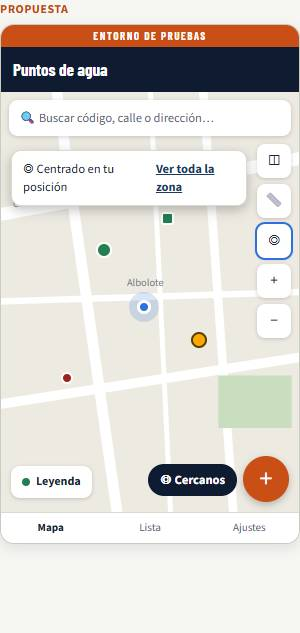</td>
<td>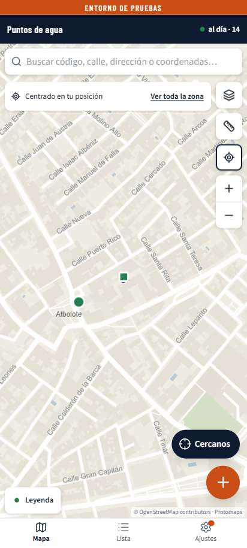</td>
<td>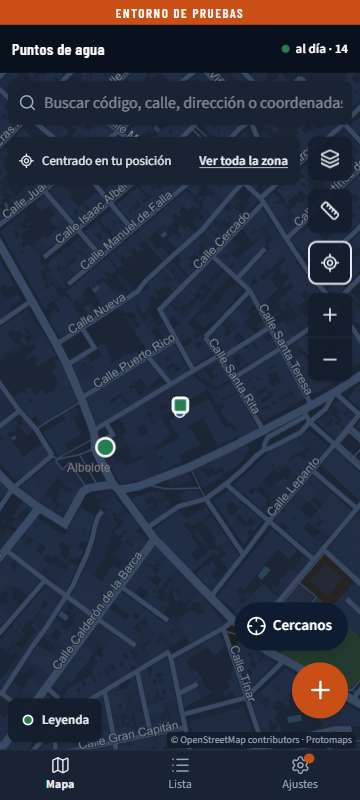</td>
<td>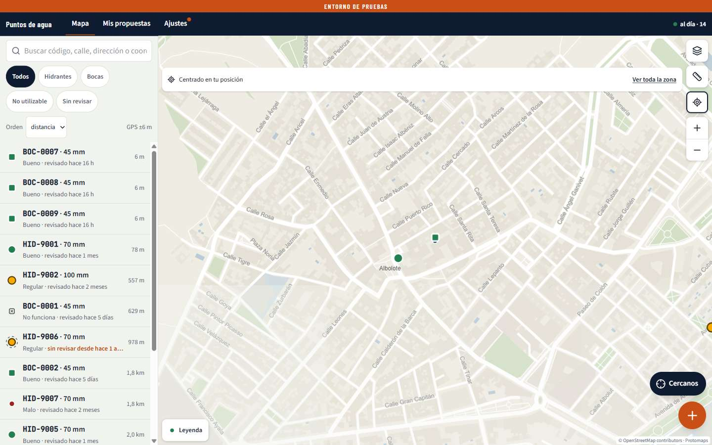</td></tr></table>

Zoom de calle centrado en la posición, «Mi posición» marcado, «Centrado en tu posición · Ver toda la zona» a los 0,40–0,47 s de abrir y ya ido a los 4,5 s (en los seis tamaños), leyenda plegada abajo a la izquierda. El punto azul de la posición sí se dibuja (medido en el DOM), pero queda debajo del marcador de BOC-0007, a 6 m: es el sitio elegido para el recorrido, no un fallo. En el ordenador el aviso ocupa todo el ancho del mapa (B6).

### U2 · Cabecera compacta en el móvil — **igual**

<table><tr><th>Mockup</th><th>Staging 412 claro (detalle)</th><th>Staging 412 oscuro (detalle)</th><th>Staging 1440 oscuro (detalle)</th></tr><tr>
<td>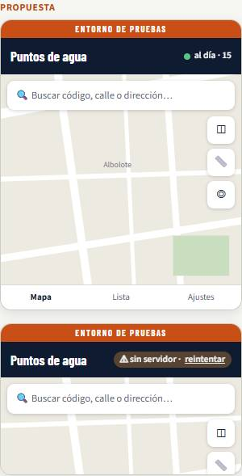</td>
<td>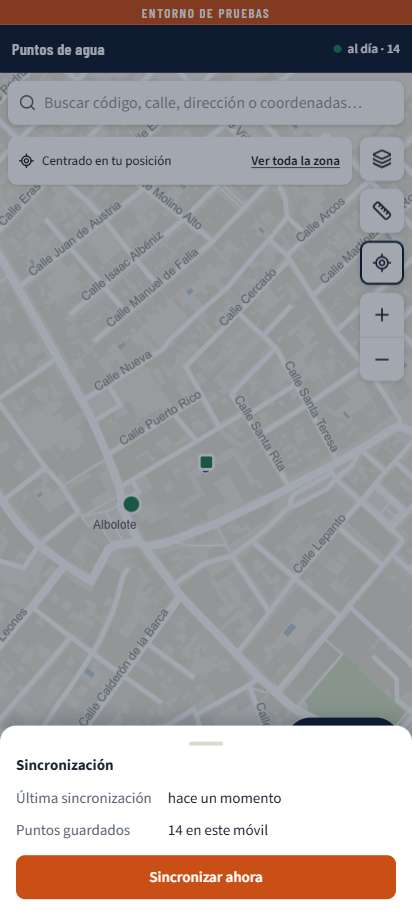</td>
<td>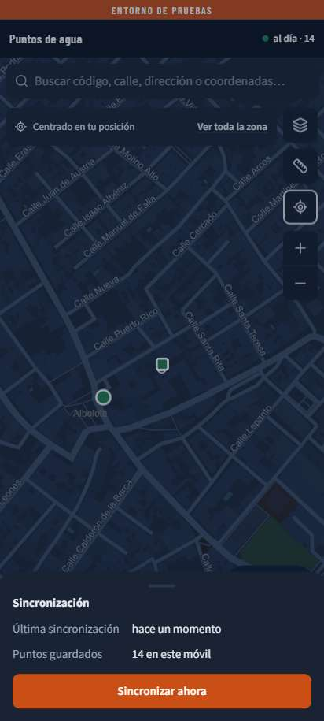</td>
<td>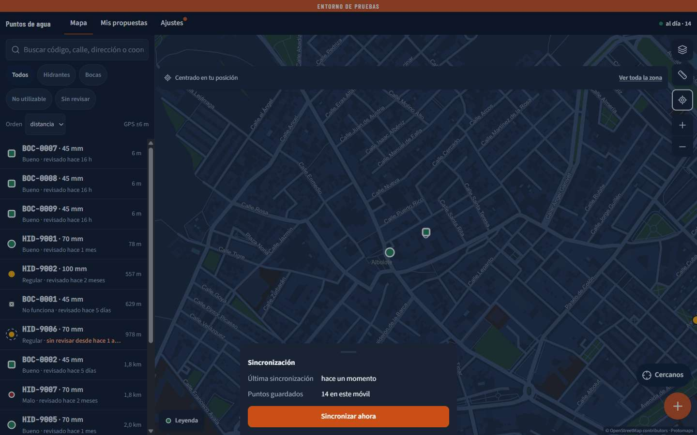</td></tr></table>

Píldora «● al día · 14» a la derecha de «Puntos de agua», sin franja aparte: **0 px** entre la cabecera y el mapa, cabecera de 73 px con la banda de pruebas (antes, hasta 270). Al tocarla, el detalle con «Última sincronización», «Puntos guardados» y *Sincronizar ahora*. Los estados «hace 2 h», «sin conexión» y «sin servidor» no se provocaron en staging (los cubre `e2e/cabecera.spec.ts`).

### U3 · Buscador: un solo ✕, portales arriba y fondo opaco — **igual**

<table><tr><th>Mockup</th><th>Staging 412 claro</th><th>Staging 412 oscuro</th><th>Staging 1440 oscuro</th></tr><tr>
<td>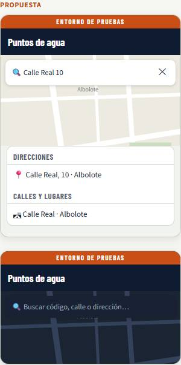</td>
<td>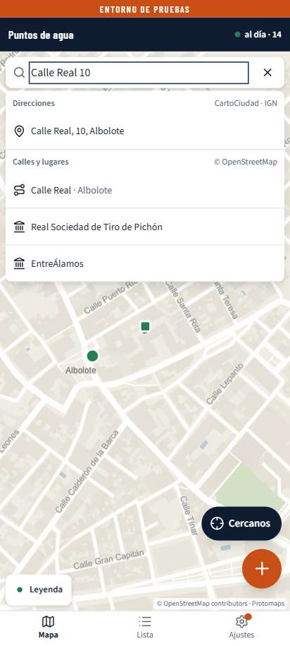</td>
<td>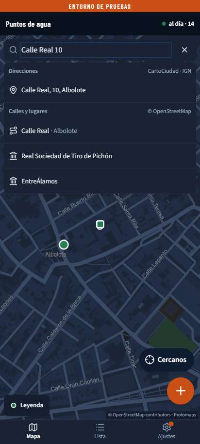</td>
<td>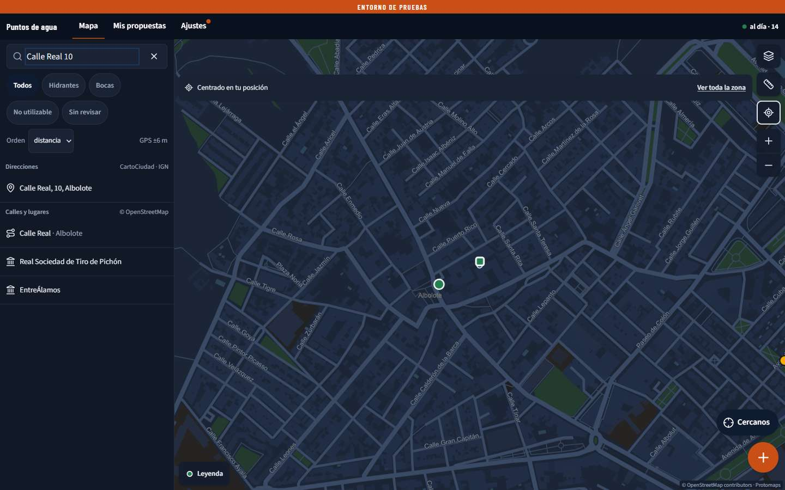</td></tr></table>

«Calle Real 10»: un solo ✕ («Borrar búsqueda»; ningún «Cerrar» a la vez), **«Direcciones» el primer grupo** con «Calle Real, 10, Albolote» de CartoCiudad, y en oscuro el campo es opaco (`rgb(26, 35, 51)`), sin el mapa a través. A 360 px y en la columna del ordenador el texto de ayuda se corta (B4).

### U4 · Aviso de versión nueva abajo, con botón — **igual en el mapa; en un formulario, se aparta**

<table><tr><th>Mockup</th><th>Mapa 412 claro</th><th>Formulario 412 claro</th><th>Formulario, al bajar (local 412)</th><th>Mapa 1440 oscuro</th></tr><tr>
<td>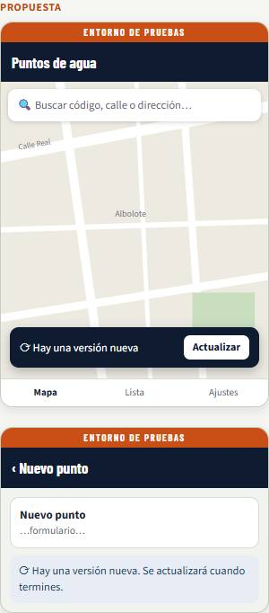</td>
<td>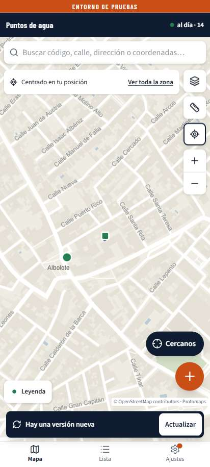</td>
<td>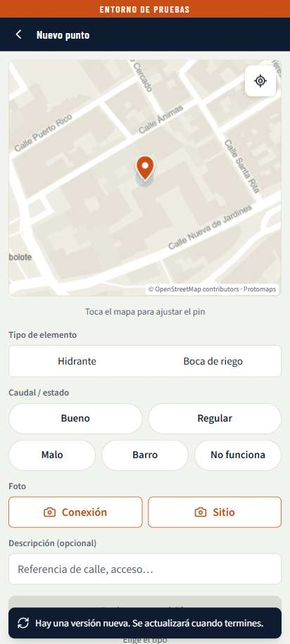</td>
<td>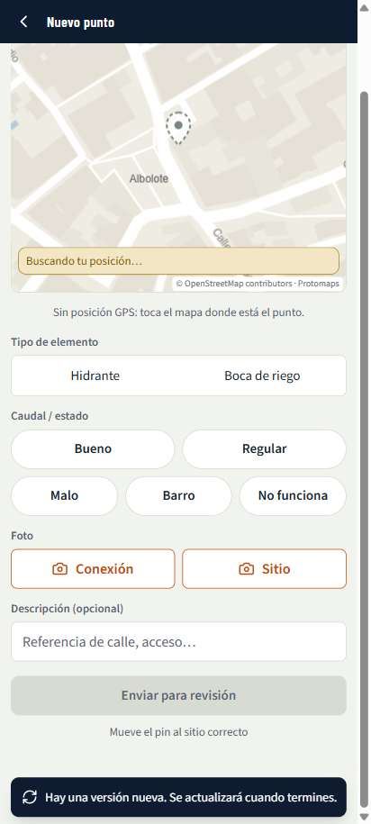</td>
<td>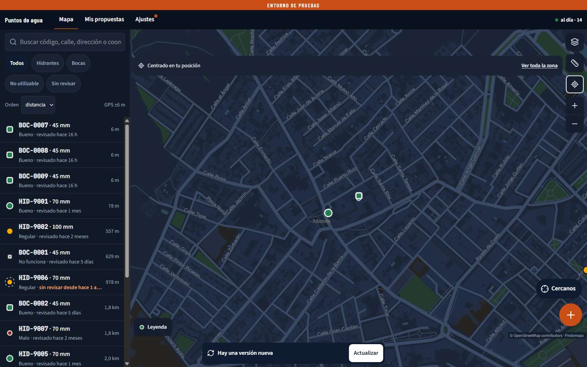</td></tr></table>

En el mapa: «⟳ Hay una versión nueva» y *Actualizar*, abajo sobre la navegación, sin tapar el buscador. En un formulario: «Hay una versión nueva. Se actualizará cuando termines.», sin botón (0 *Actualizar* en los seis tamaños). **Se aparta del mockup:** allí va en una caja bajo la cabecera del formulario; la app lo deja fijo abajo (`AvisoVersion.tsx`, RV-313), donde al abrir el alta tapa el final del formulario. No es un defecto: la página crece lo que ocupa el aviso y al bajar del todo *Enviar para revisión* queda libre (medido en local: botón 750–794 px y aviso 863–907 px a 412; 615–659 y 728–792 a 360).

### U5 · Ficha sin foto: una franja — **igual**

<table><tr><th>Mockup</th><th>Sin foto 412 claro</th><th>Sin foto 360 oscuro</th><th>Con foto 412 claro</th><th>Sin foto 1440 oscuro</th></tr><tr>
<td>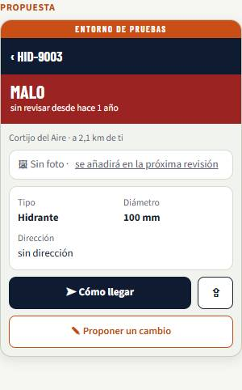</td>
<td>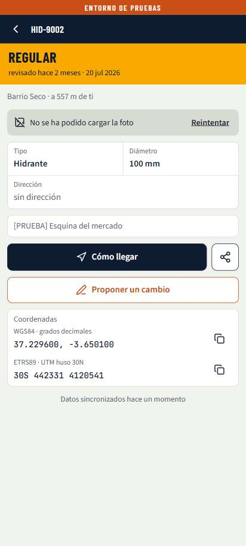</td>
<td>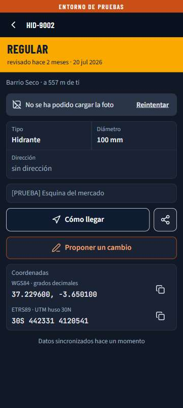</td>
<td>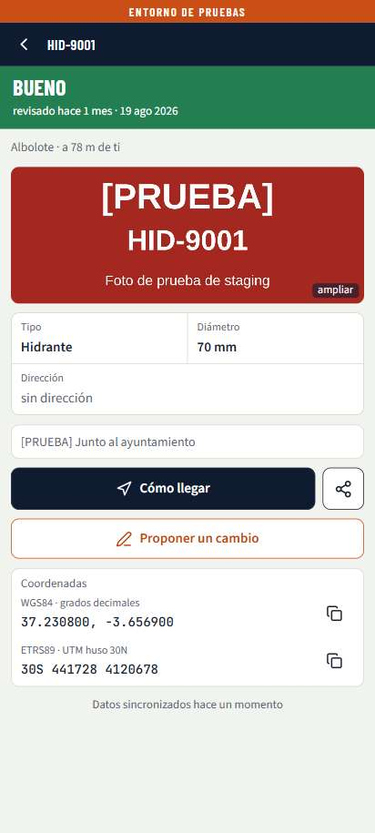</td>
<td>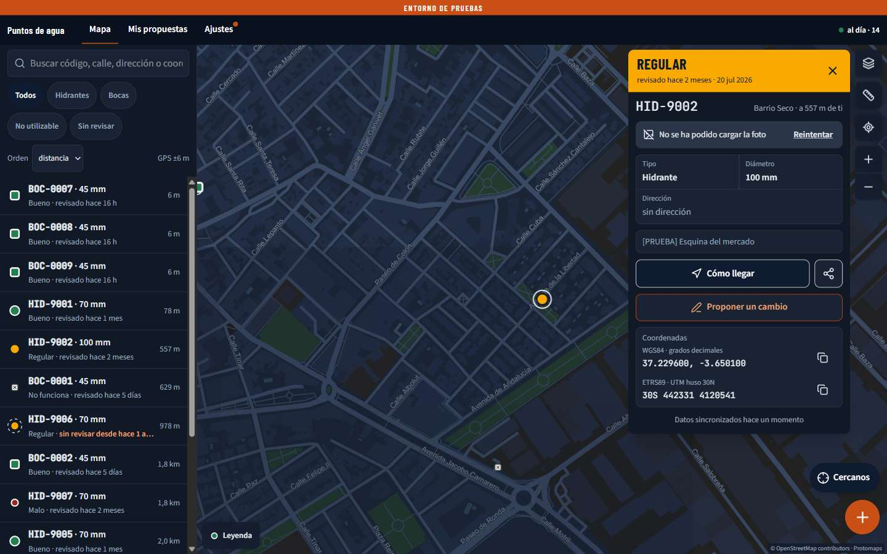</td></tr></table>

Franja de **44 px** «No se ha podido cargar la foto · Reintentar»; *Cómo llegar* acaba a 454 px (móvil) y 467 px (ordenador), en la primera pantalla. Con foto, 150 px de alto en el móvil y 170 en el ordenador (máximo 200). El texto «Sin foto» de un punto sin foto no se vio: en staging no hay ninguno (propuesta N8).

### U6 · Mis propuestas dice qué se propuso — **igual**

<table><tr><th>Mockup</th><th>Staging 412 claro</th><th>Staging 360 oscuro</th><th>Staging 1440 oscuro</th></tr><tr>
<td>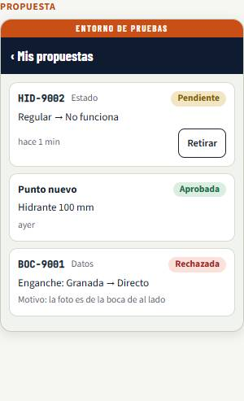</td>
<td>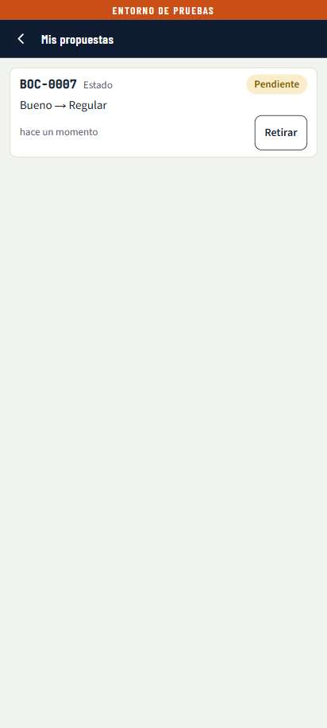</td>
<td></td>
<td>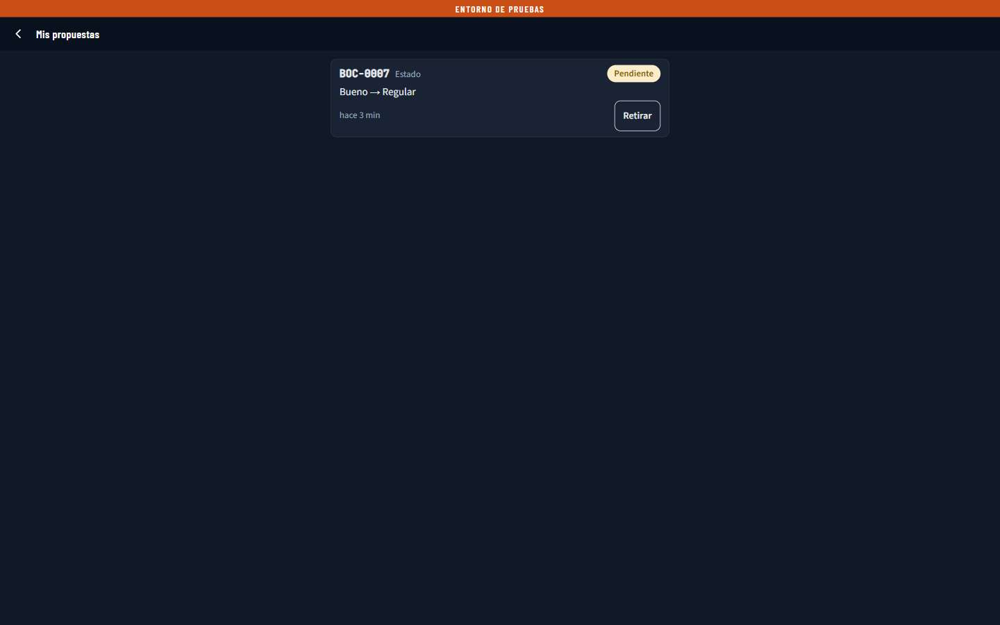</td></tr></table>

«BOC-0007 · Estado · Pendiente», debajo una sola línea «Bueno → Regular», «hace un momento» y *Retirar* de 67–71 × **44** px (D10 arreglado). Solo se vio una pendiente (aprobadas y rechazadas, en `e2e`: el recorrido no debe resolver nada en staging). Una vez, abriendo Mis propuestas directamente en un dispositivo recién estrenado, la línea dijo solo «Regular» hasta que llegaron los puntos (B3).

### U7 · Formularios: foto opcional y textos que no se parten — **igual**

<table><tr><th>Mockup</th><th>Corregir datos 412 claro</th><th>Corregir datos 360 claro</th><th>Alta con foto 412 claro</th><th>Corregir datos 1440 oscuro</th></tr><tr>
<td>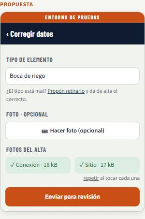</td>
<td>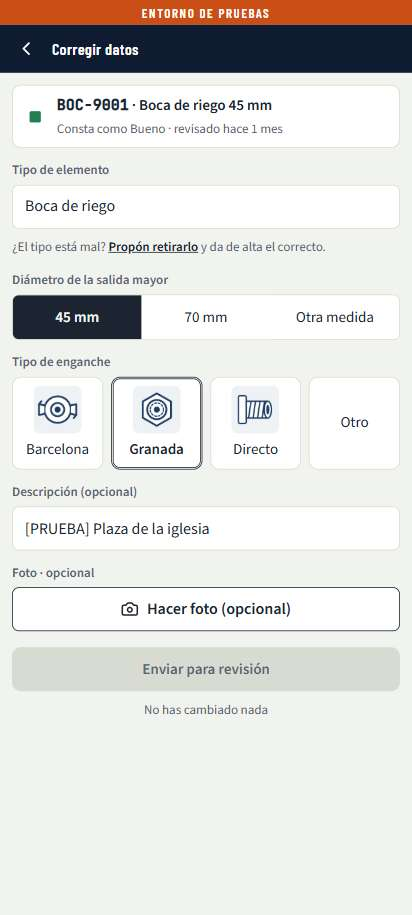</td>
<td>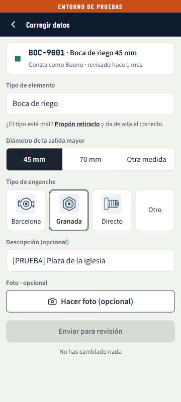</td>
<td>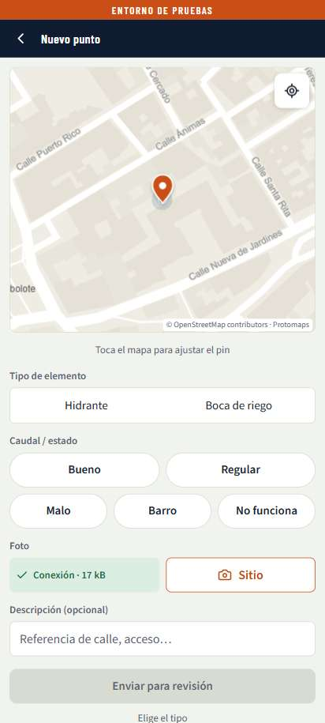</td>
<td>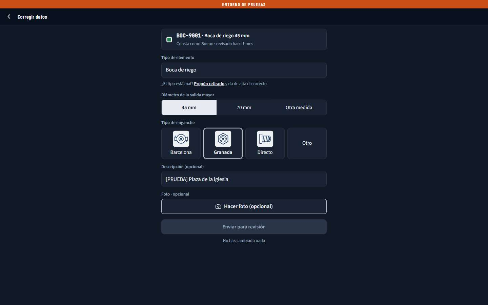</td></tr></table>

*Corregir datos*: «Foto · opcional» con *Hacer foto (opcional)* como botón secundario, y «¿El tipo está mal? **Propón retirarlo** y da de alta el correcto.» en una frase, sin «·» colgando. En el alta, la foto hecha en una línea: «✓ Conexión · 17 kB» (21 px de alto, también a 360 px). Sin desborde horizontal.

### U8 · Capas en palabras, con miniatura — **igual**

<table><tr><th>Mockup</th><th>Staging 412 claro</th><th>Staging 360 oscuro</th><th>Staging 1440 oscuro</th></tr><tr>
<td>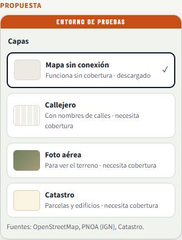</td>
<td>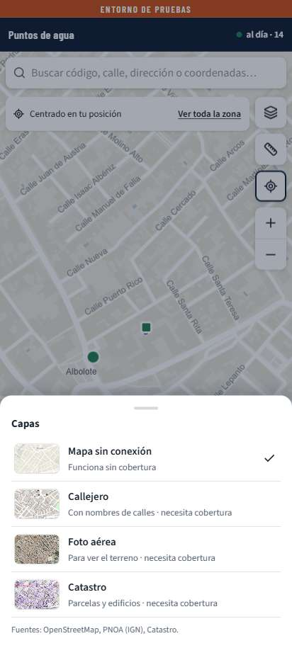</td>
<td>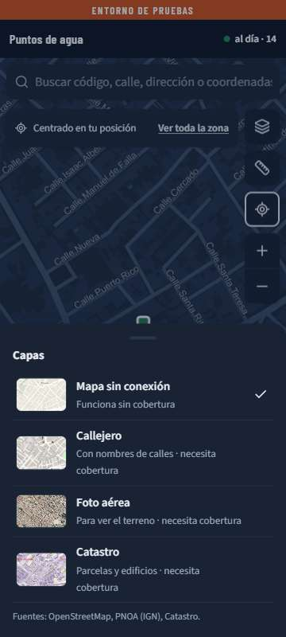</td>
<td>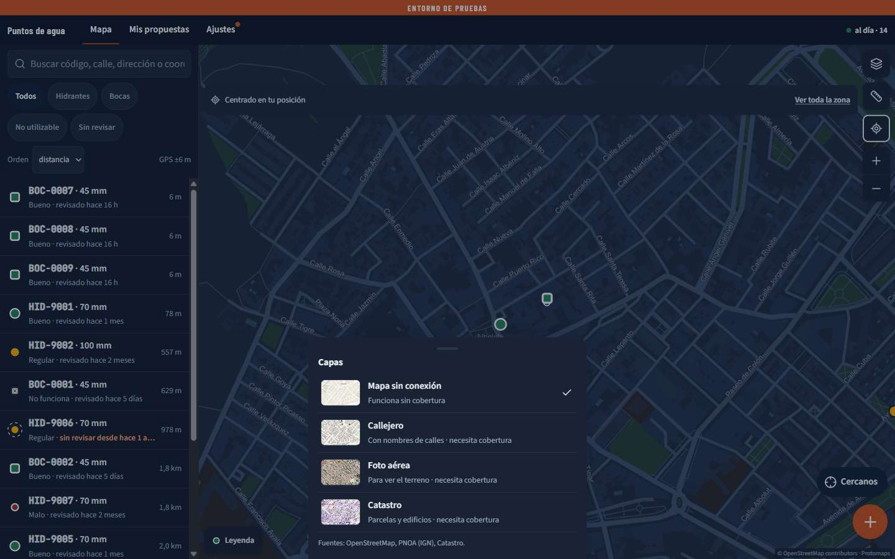</td></tr></table>

«Mapa sin conexión · Funciona sin cobertura», «Callejero · Con nombres de calles», «Foto aérea · Para ver el terreno», «Catastro · Parcelas y edificios», cada una con su miniatura y «· necesita cobertura» en las tres en línea; las siglas solo en «Fuentes: OpenStreetMap, PNOA (IGN), Catastro.».

### U9 · Medir: etiquetas que no se pisan — **igual**

<table><tr><th>Mockup</th><th>Staging 412 claro</th><th>Staging 412 oscuro</th><th>Staging 1440 claro</th></tr><tr>
<td>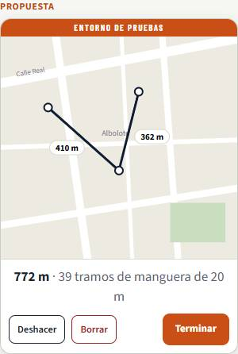</td>
<td>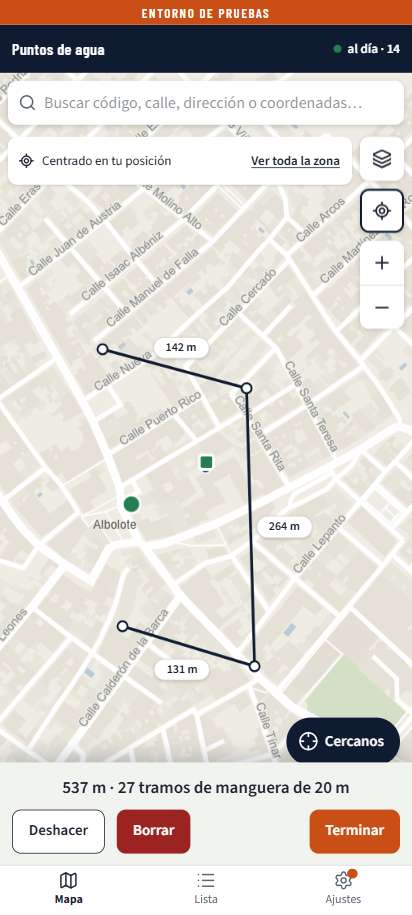</td>
<td>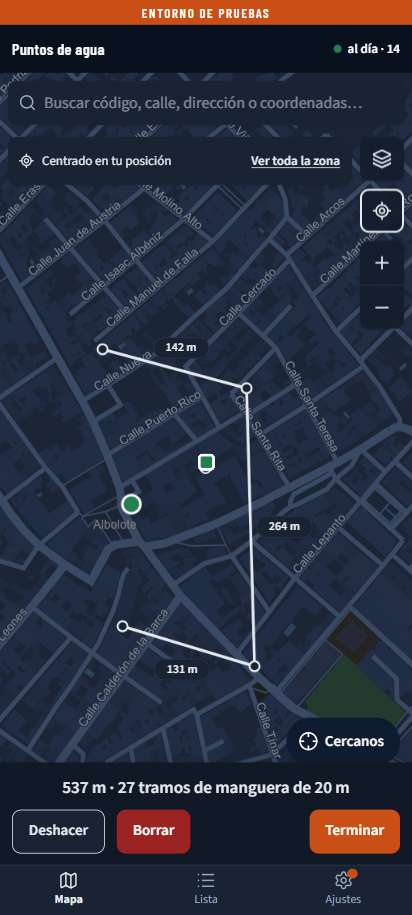</td>
<td>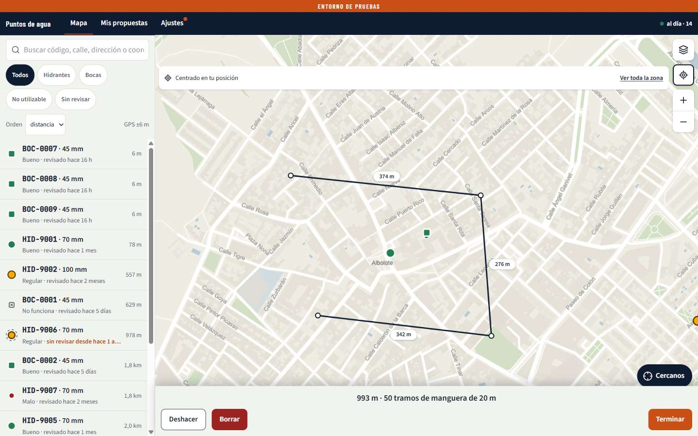</td></tr></table>

Tres tramos con su píldora apartada de la línea, sin pisarse en los vértices; el total en la fuente normal: «537 m · 27 tramos de manguera de 20 m». En oscuro la píldora es oscura (`--papel`, DEC-192).

### U10 · Leyenda: Barro y No funciona se distinguen — **igual**

<table><tr><th>Mockup</th><th>Leyenda 412 claro</th><th>Leyenda sola 412 oscuro</th><th>Leyenda sola 1440 claro</th></tr><tr>
<td>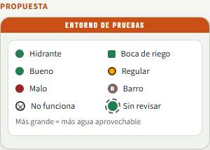</td>
<td>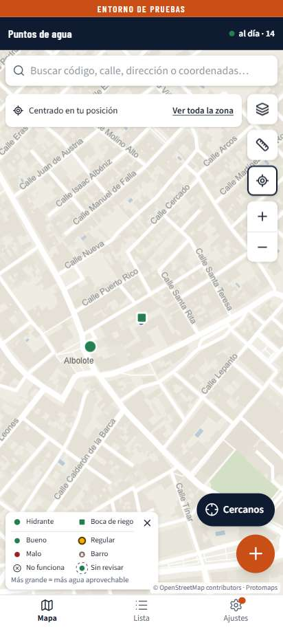</td>
<td>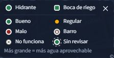</td>
<td>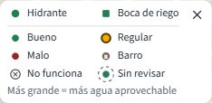</td></tr></table>

Dos grupos (tipo arriba, estado debajo); Barro marrón lleno con «B», No funciona blanco con borde y «✕», Sin revisar con el anillo discontinuo. En el mapa, BOC-0001 (No funciona) sale con el mismo icono que en la leyenda.

### U11 · Ajustes de la app sin jerga — **igual**

<table><tr><th>Mockup</th><th>Staging 412 claro</th><th>Staging 360 oscuro</th><th>Staging 1440 claro</th></tr><tr>
<td>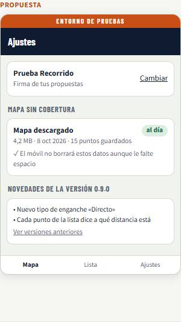</td>
<td>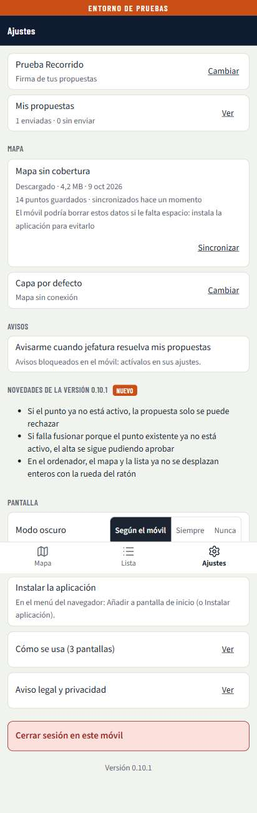</td>
<td>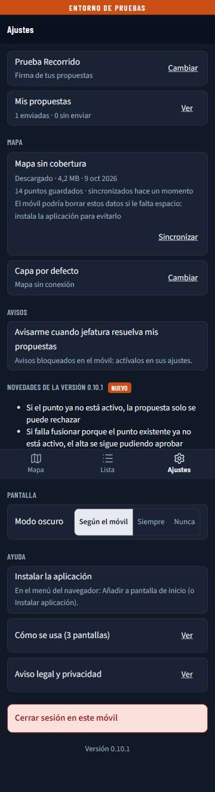</td>
<td>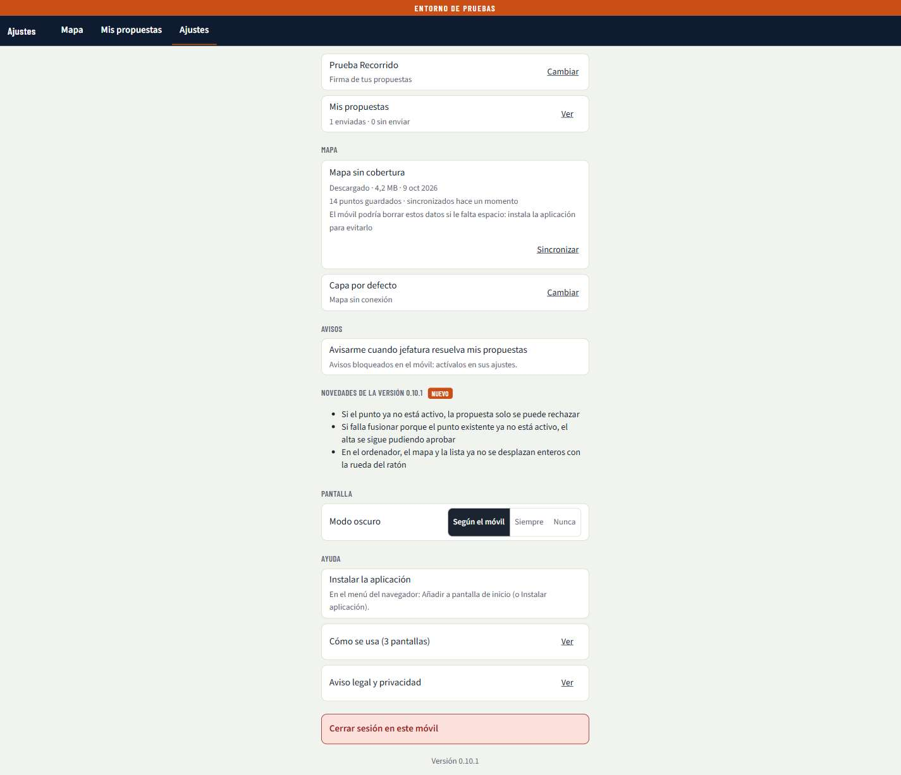</td></tr></table>

Una sola tarjeta «Mapa sin cobertura» (descargado · 4,2 MB · 9 oct 2026 · 14 puntos guardados); el guardado protegido en una frase («El móvil podría borrar estos datos si le falta espacio: instala la aplicación para evitarlo»); las novedades sin repetir la versión en cada línea. En la captura de página entera la barra de abajo sale a media página: es la barra fija, no un fallo. «1 enviadas · 0 sin enviar» (B1).

### U12 · Escritorio: navegación arriba, sin barra abajo — **igual en el mapa; Mis propuestas se aparta (#625)**

<table><tr><th>Mockup</th><th>Mapa 1440 claro</th><th>Mapa 1440 oscuro</th><th>Mis propuestas 1440 claro</th></tr><tr>
<td>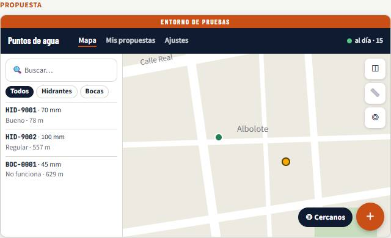</td>
<td>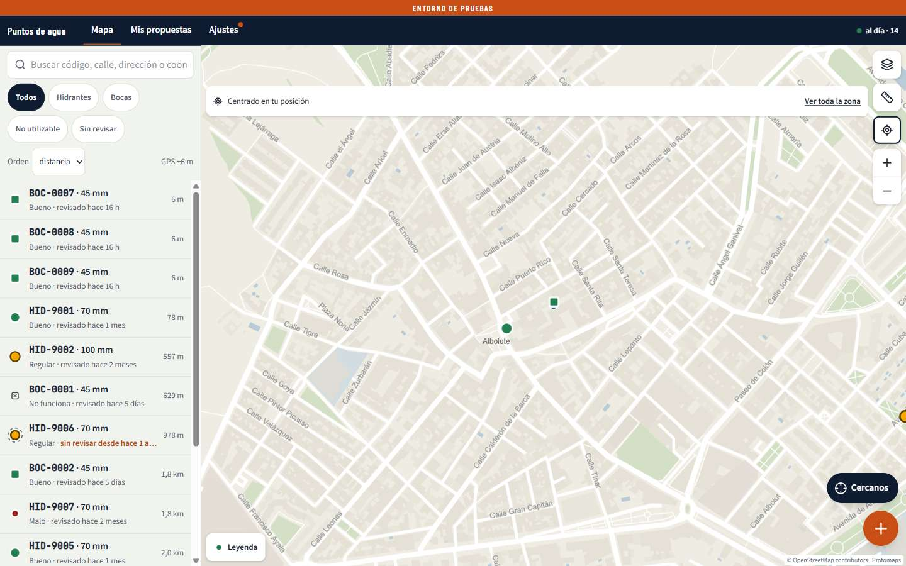</td>
<td>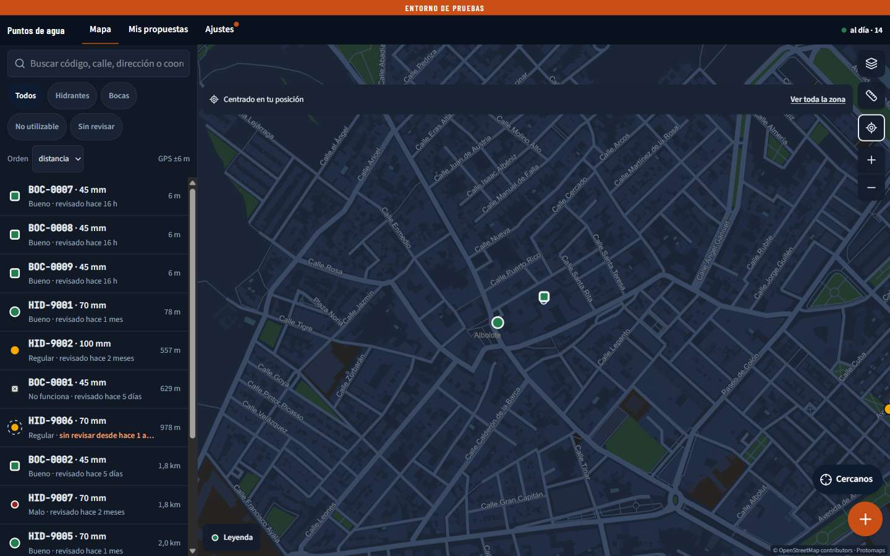</td>
<td>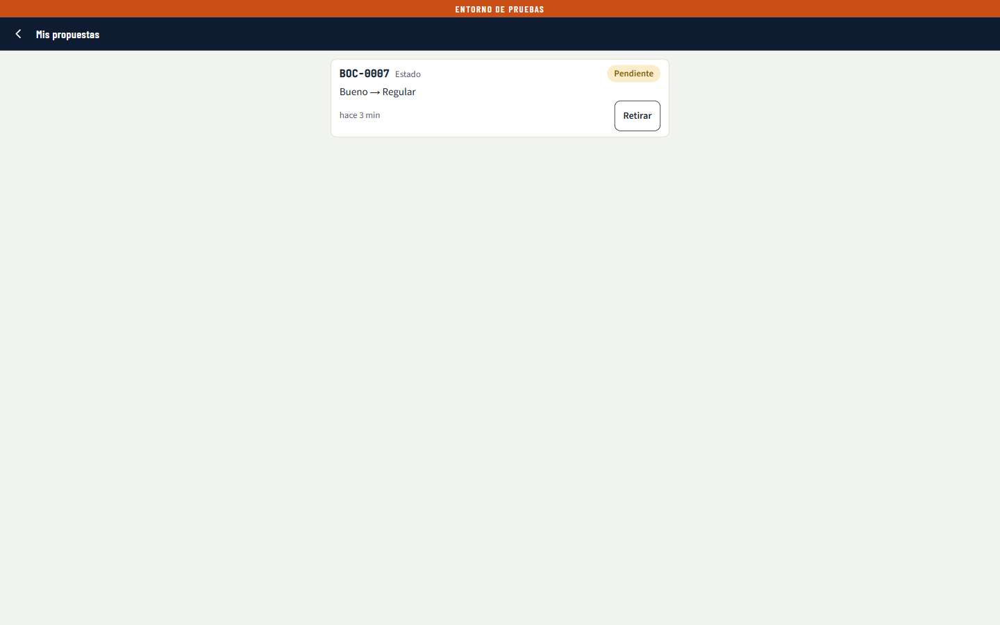</td></tr></table>

Una sola navegación, arriba («Mapa · Mis propuestas · Ajustes», sin *Lista*), sin barra abajo; lista lateral con los filtros en dos líneas; la página no se desplaza (0 px). **Se aparta:** al pulsar *Mis propuestas* la barra desaparece y queda «‹ Mis propuestas» (D1, #625).

### U13 · Panel: Salud del sistema en palabras — **igual, con DEC-192**

<table><tr><th>Mockup</th><th>Todo bien, claro</th><th>Necesita atención, oscuro</th></tr><tr>
<td>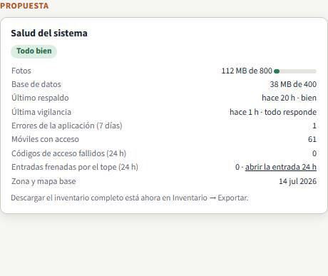</td>
<td>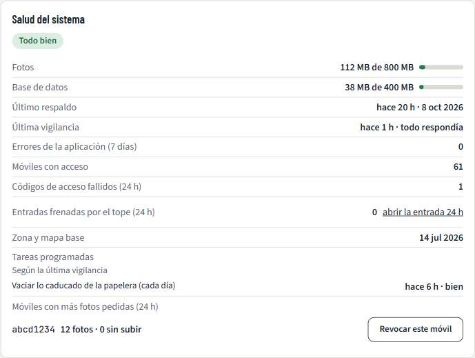</td>
<td>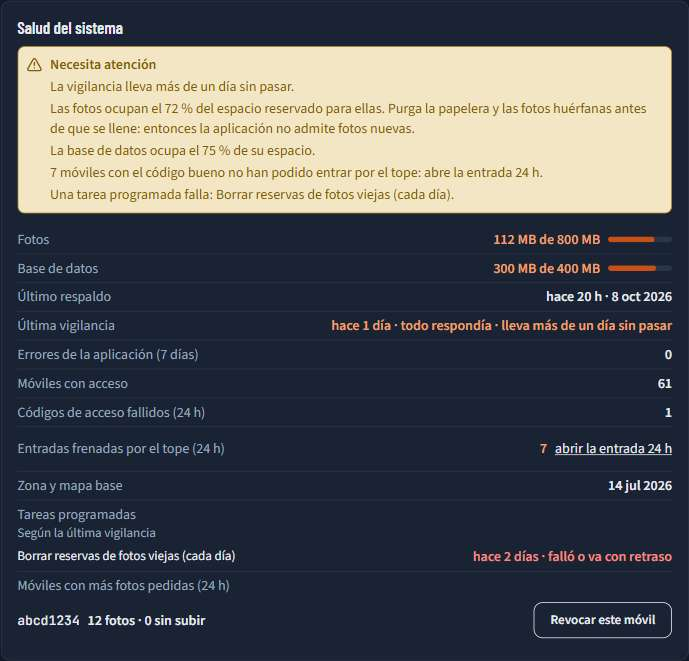</td></tr></table>

«Todo bien» arriba, o «Necesita atención» con la lista de lo que falla (vigilancia, fotos al 72 %, base al 75 %, 7 móviles frenados por el tope, una tarea que falla; en el simulado los MB de fotos y su porcentaje no cuadran entre sí: son datos de prueba); fotos y base con su barra; fuera las cuatro filas que pidió quitar el desarrollador. **Lo que difiere del mockup ya está decidido en DEC-192:** siguen «Tareas programadas» (en palabras: «Vaciar lo caducado de la papelera (cada día)») y «Móviles con más fotos pedidas (24 h)».

### U14 · Panel con poca pantalla, sin minimapa — **igual**

<table><tr><th>Mockup</th><th>720 × 450 claro</th><th>720 × 450 oscuro, menú ☰</th><th>1440 × 900 oscuro</th></tr><tr>
<td>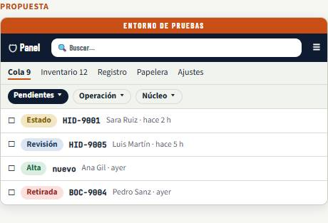</td>
<td>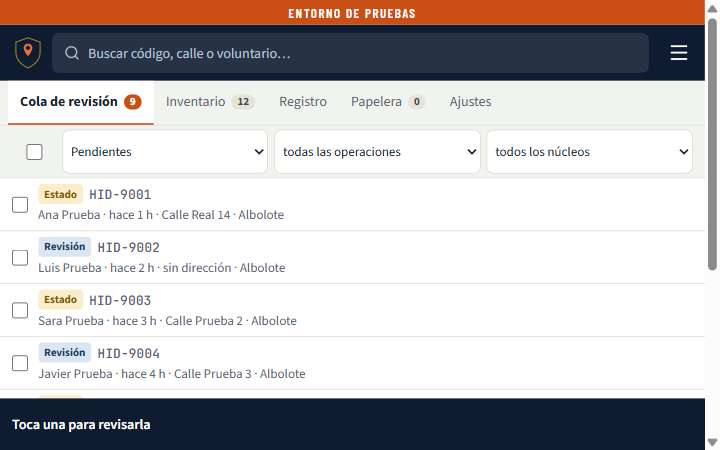</td>
<td>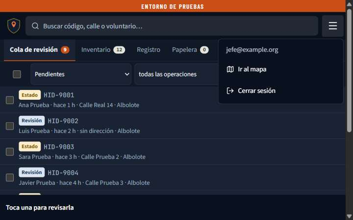</td>
<td>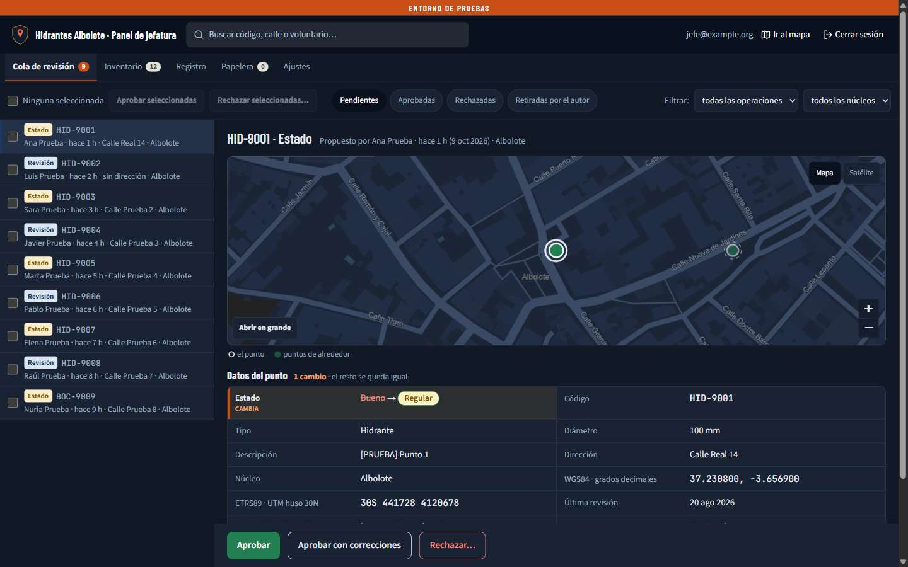</td></tr></table>

Ningún mapa en las filas de la Cola (0 `leaflet-container` en la lista). A 720 × 450 se ven **4 propuestas enteras** (antes 1,5), el buscador va en la barra, *Ir al mapa* y *Cerrar sesión* en el menú ☰, y los filtros son tres desplegables en una línea; sin desborde. A 1440 × 900, 9 filas a la vista.

### U15 · Cola: un punto que ya no está activo — **igual en lo esencial; se aparta en dos detalles**

<table><tr><th>Mockup</th><th>1440 claro</th><th>1440 oscuro, rechazar</th><th>412 claro</th></tr><tr>
<td>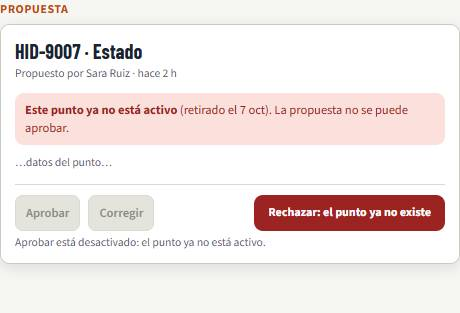</td>
<td>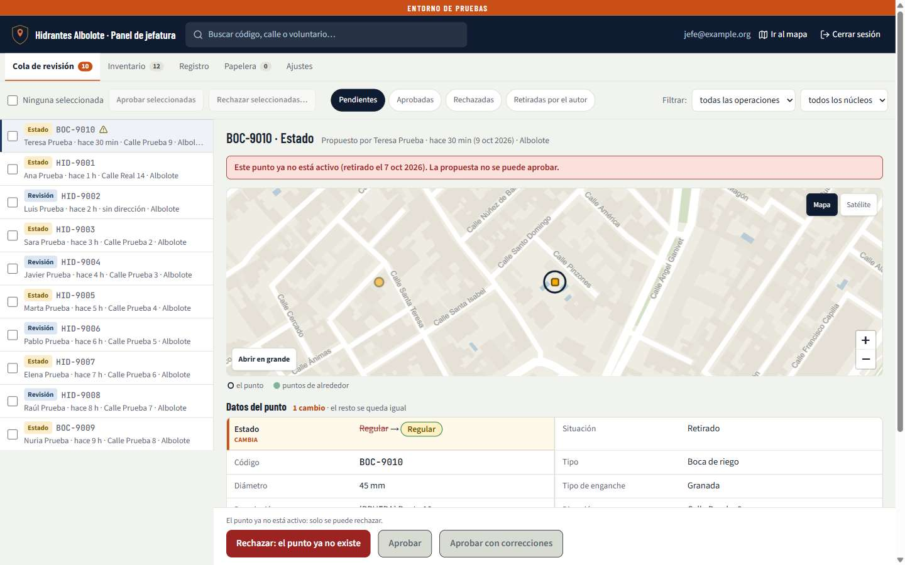</td>
<td>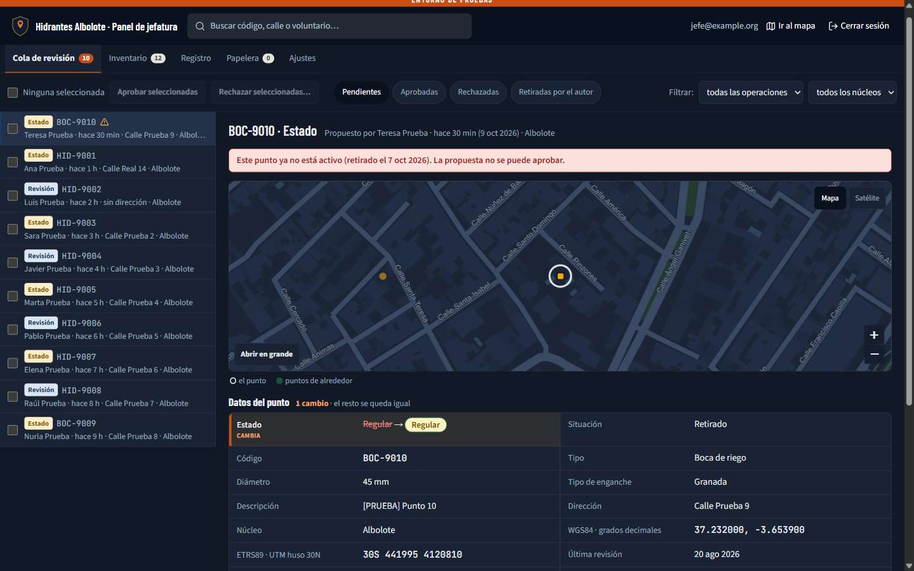</td>
<td>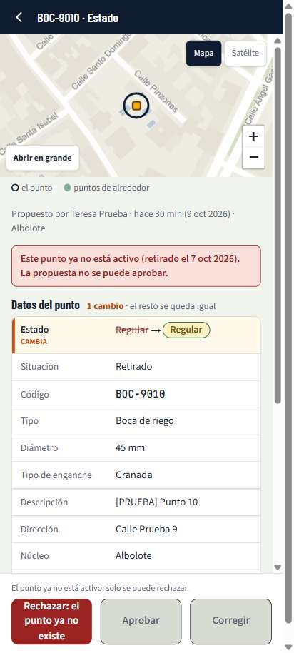</td></tr></table>

⚠ en la fila; arriba, en rojo, «Este punto ya no está activo (retirado el 7 oct 2026). La propuesta no se puede aprobar.»; *Aprobar* y *Aprobar con correcciones* deshabilitados con el motivo escrito («El punto ya no está activo: solo se puede rechazar.»); la acción principal es «Rechazar: el punto ya no existe», que abre el rechazo con el motivo ya escrito. **Se aparta:** el motivo va encima de los botones (en el mockup, debajo), y en el móvil el aviso rojo queda debajo del minimapa, aún en la primera pantalla. En el móvil el botón rojo se parte en tres líneas (B2). El lote que la salta lo cubre `e2e/panel-cola.spec.ts` (RV-330).

### RV-338 · La entrada del día del lanzamiento, en Ajustes del panel (sin mockup)

<table><tr><th>Cerrada, claro</th><th>Abierta, oscuro</th><th>Parámetros, claro</th></tr><tr>
<td>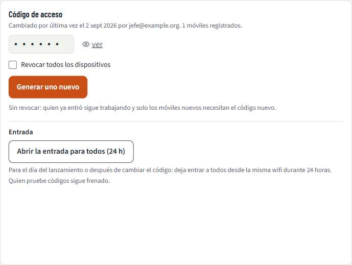</td>
<td>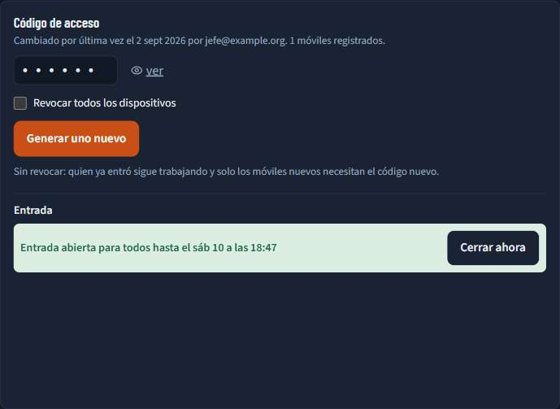</td>
<td>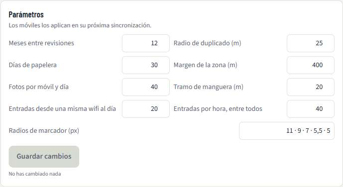</td></tr></table>

Sección «Entrada» dentro de *Código de acceso*: cerrada, con «Abrir la entrada para todos (24 h)» directo, sin diálogo (DEC-192); abierta, la franja «Entrada abierta para todos hasta el sáb 10 a las 18:46» con *Cerrar ahora*. Los dos topes en *Parámetros* (20 y 40, los de 0041 sin fila en `config`). En Salud, «Entradas frenadas por el tope (24 h)» con el enlace «abrir la entrada 24 h». En oscuro la franja sigue verde claro, como el chip «Todo bien» (`--verde-100` no tiene variante oscura; propuesta N10). «1 móviles registrados» (B1).

## 3. Defectos encontrados

| Id | Gravedad | Issue | Qué |
|---|---|---|---|
| D1 | media | **#625** (no `bloquea-release`) | Escritorio: *Mis propuestas* se abre sin la navegación de arriba |
| B1–B6 | baja | — | Abajo |

**D1 · media · #625.** *Pasos:* app en el ordenador (≥ 1100 px), barra de arriba → *Mis propuestas*. *Esperado:* «Mapa · Mis propuestas · Ajustes» también ahí (U12). *Pasa:* cabecera propia «‹ Mis propuestas», sin la barra; en Ajustes sí está. *Causa:* `/mis-propuestas` se monta en `src/paginas/RutasDentro.tsx` fuera del armazón que pinta `NavegacionArriba`. Captura: `u12-escritorio-mis-propuestas-e1440-claro.jpg`.

Bajos (sin issue, para un docs/34 si se quiere):

- **B1 · Plurales.** «1 enviadas · 0 sin enviar» en Ajustes (`T.misPropuestas.resumen`) y «1 móviles registrados.» en *Código de acceso* del panel (`T.panelAjustes`, cambiado y sin cambios). Capturas: `u11-ajustes-m412-claro.jpg`, `p38-entrada-abierta-panel-claro.jpg`.
- **B2 · Panel en el móvil:** «Rechazar: el punto ya no existe» se parte en tres líneas a 412 px junto a *Aprobar* y *Corregir*. Captura: `p15-cola-movil-detalle-panel-claro.jpg`.
- **B3 · Mis propuestas, la primera vez:** abriendo `/mis-propuestas` en un dispositivo recién estrenado, la línea dice «Regular» y no «Bueno → Regular» hasta que llegan los puntos (se vio una vez de seis; la captura, tomada después, ya lo dice bien).
- **B4 · Buscador recortado:** «Buscar código, calle, dirección o coordenadas…» se corta a 360 px («…coordenadas» sin acabar) y en la columna del ordenador («…o coor»). Capturas: `u01-mapa-al-abrir-m360-claro.jpg`, `u01-mapa-al-abrir-e1440-claro.jpg`.
- **B5 · Nombre accesible del enlace a Ajustes** con novedades sin ver: «Novedades Ajustes» (el punto con `aria-label` va delante del texto). Un lector de pantalla lo lee así, y un test que busque el enlace «Ajustes» exacto no lo encuentra.
- **B6 · Ordenador:** «Centrado en tu posición · Ver toda la zona» ocupa los 1050 px de ancho del mapa para dos textos cortos. Captura: `u01-mapa-al-abrir-e1440-claro.jpg`.

## 4. Propuestas nuevas

Como mucho 10, por prioridad. **No se implementan aquí.**

| # | Qué cambiar | Por qué | Esfuerzo |
|---|---|---|---|
| N1 | Una función de plural en `textos.ts` para «1 móvil registrado», «1 enviada» y los demás contadores | B1: con un solo elemento el texto suena roto, y el día del lanzamiento habrá muchos «1» | S |
| N2 | En el ordenador, el aviso «Centrado en tu posición» como píldora compacta arriba a la izquierda del mapa | B6: una barra de 1050 px para dos palabras tapa calles sin aportar | S |
| N3 | Panel en el móvil: el aviso rojo del punto retirado **encima** del minimapa y los botones de la barra apilados (Rechazar a lo ancho) | B2 y U15 en el móvil: lo importante va primero y el botón no se parte | S |
| N4 | Texto de ayuda del buscador más corto: «Código, calle o dirección…» (las coordenadas se siguen aceptando) | B4: hoy se corta a 360 px y en la columna del ordenador | S |
| N5 | Mis propuestas con el «antes» de la propia propuesta (el servidor ya lo tiene, `antes`) y no del punto guardado en el móvil | B3: no depende de que el móvil haya sincronizado | S |
| N6 | El punto de novedades del enlace a Ajustes como texto oculto **después**: «Ajustes, hay novedades» | B5: se lee mejor y el nombre empieza por lo que es | S |
| N7 | Una ayuda de e2e para «hay versión nueva» con el truco de este recorrido (`register('/sw.js?x')`) y un e2e del aviso en el mapa y en un formulario | Hoy el aviso solo tiene unitarios; este recorrido lo ha provocado de verdad sin tocar el servidor | S |
| N8 | Un punto `[PRUEBA]` sin foto en `supabase/seed-staging.sql` | Para ver en staging la franja «Sin foto» de U5, no solo la de «si falla» | S |
| N9 | En el formulario, el aviso de versión como la caja del mockup (bajo la cabecera, en el flujo) y no fijo abajo | U4: al abrir el alta tapa el final del formulario hasta que se baja | S |
| N10 | Variantes oscuras de `--verde-100` y del ámbar de aviso (franja «Entrada abierta», chip «Todo bien», caja «Necesita atención») | En oscuro son las únicas superficies claras de la pantalla | S |

## 5. Consola y tiempos

| Origen | Qué | Por qué |
|---|---|---|
| Staging | 6 × `ERR_CONNECTION_REFUSED` (una por tamaño, en U5) | Provocados: se cortaron las fotos para ver la franja de «si falla» |
| Staging | ningún otro error ni `pageerror` en los 75 pasos | — |
| Local (panel simulado) | `ECONNREFUSED 127.0.0.1:8788` en el servidor de `vite preview` | Sin Pages Functions en local (lo mismo que en RV-270): es del montaje, no de la app |

El aviso «Centrado en tu posición» sale entre 0,40 y 0,47 s después de abrir la app en staging, en los seis tamaños.

## Desviaciones de la especificación

- **Panel simulado**, no en staging: la entrada con Google no se automatiza (como en RV-270); el build es el del mismo commit (`9f6d7cc`) con `VITE_ENTORNO=staging` y el Supabase de pruebas.
- **Aviso de versión** provocado en el navegador del recorrido (otro `scriptURL` para el mismo `sw.js`), no con un despliegue; lo de *Enviar* al bajar del todo, medido en local con el mismo truco.
- **Ficha sin foto:** en staging no hay ningún punto sin foto (RV-340); se vio la franja con la foto cortada en el navegador.
- **Mis propuestas:** solo una pendiente; no se aprobó ni rechazó nada a propósito para ver esos estados (los rechaza la limpieza, que no deja nada).
- **Estados de la cabecera** «hace 2 h», «sin conexión» y «sin servidor»: no se provocaron contra staging; los cubre `e2e/cabecera.spec.ts`.
