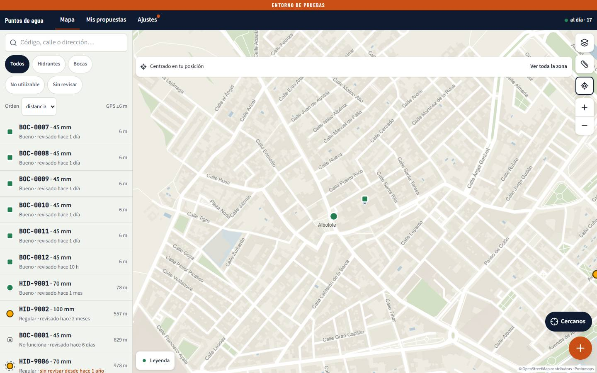
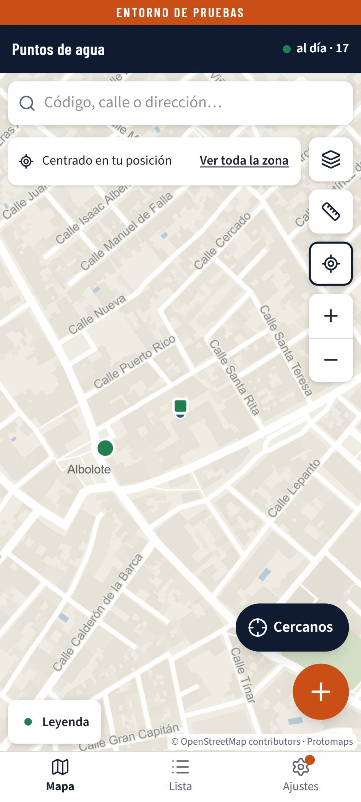
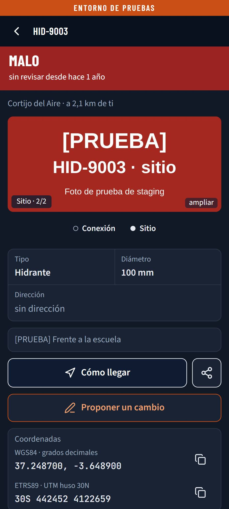
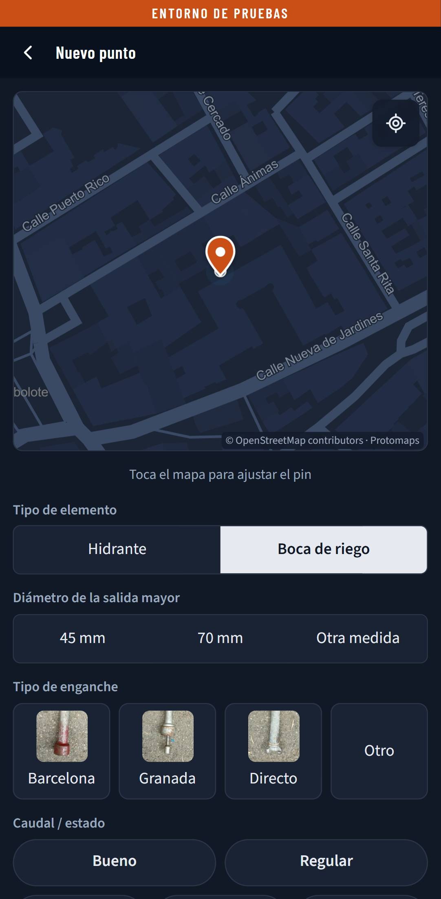
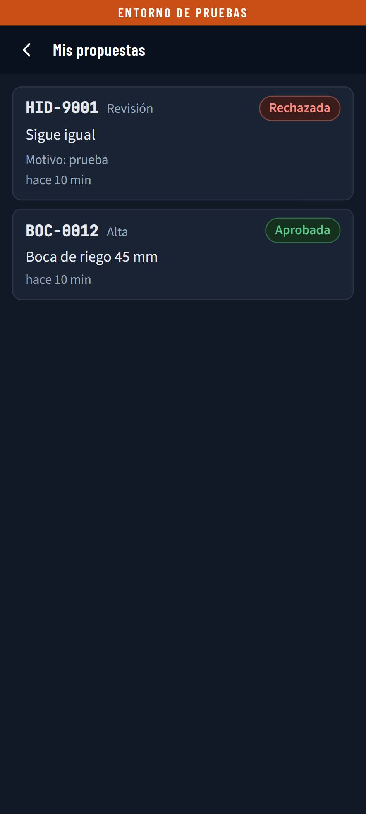

# Recorrido corto de lo cambiado en staging · 10 oct 2026 (docs/34 RV-362, DEC-184)

| | |
|---|---|
| **Qué** | Lo que cambió `docs/34` para el voluntario (RV-350 a RV-356), en staging de verdad, con el commit `8f7359d`. |
| **Tamaños** | Pixel 7 a 412 × 915, el mismo a 360 × 800 y escritorio a 1440 × 900, cada uno en claro y en oscuro: seis proyectos de Playwright. |
| **Sesión** | El token de prueba de la comprobación RV-139b de ese commit, creado en la base (nadie teclea el código), y dado de baja al acabar ([`revision-completa-staging.md`](revision-completa-staging.md)). |
| **Capturas** | El juego completo (30 JPEG) se queda fuera de Git, en `recorridos/2026-10-10/` (DEC-195). Aquí van solo las que se comentan. |
| **Propuestas** | Ninguna (DEC-193). Lo que se ha visto y no es un defecto va como issue `tras-piloto`. |

## Resultado

| Punto | Qué se comprueba | Resultado |
|---|---|---|
| RV-351 · buscador | En los seis proyectos, el texto de ayuda es «Código, calle o dirección…» y cabe en el campo, medido con `measureText` y la fuente calculada del campo. El nombre accesible sigue siendo el largo. | 6 en verde |
| RV-353 · Ajustes | Con el punto de novedades a la vista, el enlace se llama «Ajustes, hay novedades»; sin él, «Ajustes». | 6 en verde |
| RV-354 · ficha con dos fotos | HID-9003: con «Conexión» y con «Sitio» carga cada foto (`naturalWidth > 0`), y no sale la franja «no se ha podido cargar». | 6 en verde |
| RV-356 · fotos de los enganches | En el alta de una boca, las tres tarjetas llevan `barcelona.webp`, `granada.webp` y `directo.webp`, cargadas a 160 px. | 6 en verde |
| RV-350 y RV-355 · Mis propuestas | Los chips llevan tinte. En oscuro, la luminancia del fondo es menor que 0,05; en claro, mayor que 0,6. Ningún contador dice «1 …s». | 6 en verde |
| RV-352 y RV-355 en el panel | No hay entrada con Google automatizada (DEC-184). Se probaron con los e2e del panel: `panel-cola.spec.ts` «punto que ya no existe, en el móvil» y `panel-ajustes.spec.ts` «en oscuro…», en #640 y #644. | en verde en la CI |

Total: 30 en verde.

## Capturas comentadas

| | |
|---|---|
|  | A 1440 × 900 el texto de ayuda cabe entero en la columna. A la vez, el punto naranja de novedades está junto a «Ajustes». |
|  | A 360 × 800, igual. |
|  | HID-9003 en oscuro con la foto del sitio de prueba («Sitio · 2/2»), y «Conexión» y «Sitio» debajo. |
|  | Las tres fotos de los enganches en el alta, en oscuro. Se distinguen a ese tamaño. |
|  | «Rechazada» y «Aprobada» en tinte oscuro con su borde, y no como cajas claras. |

## Visto, sin ser un defecto de `docs/34`

- En staging hay seis bocas de prueba una encima de otra (BOC-0007 a BOC-0012), porque cada comprobación
  RV-139b aprueba una alta en el mismo sitio. Va como #651 (`tras-piloto`).
